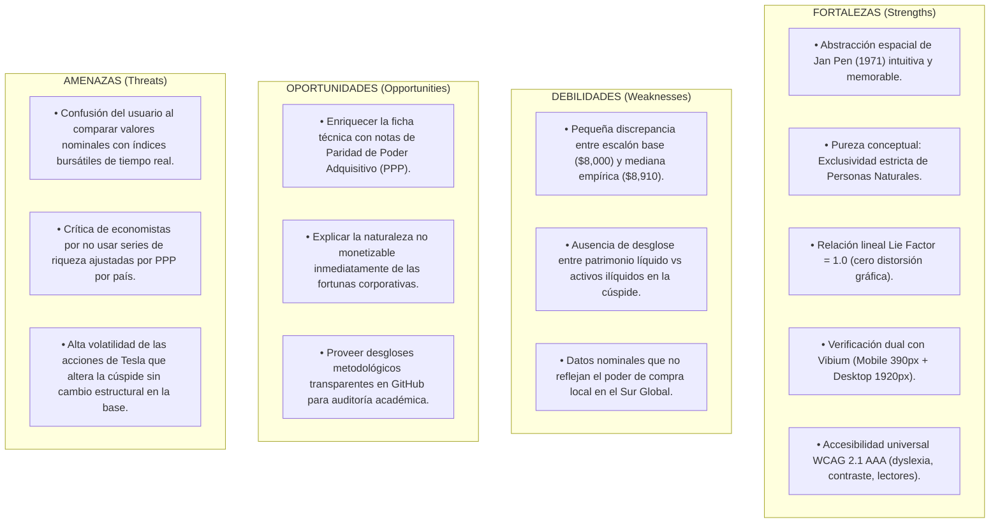

# 17. Auditoría Metodológica de la Línea Base, Evaluación de Fuentes y Análisis SWOT

## 1. Justificación y Propósito de la Auditoría

Este documento establece la evaluación cuantitativa, ontológica y metodológica de la **Línea Base Activa (UBS Global Wealth Report 2024 + Forbes Real-Time Billionaires)**.

El objetivo central es consolidar la solidez epistemológica de la línea base antes de cualquier proyección o adaptación a datasets futuros, garantizando que:
1. La metáfora física espacial refleje con fidelidad matemática los datos primarios.
2. La figura de **Elon Musk** y la cúspide de riqueza estén debidamente contextualizadas frente a la volatilidad bursátil y las valoraciones de empresas privadas.
3. Se comuniquen de forma transparente y sin omisiones todos los **riesgos epistemológicos y limitaciones metodológicas** de la medición.

---

## 2. Auditoría Detallada de Fuentes y Métricas de la Línea Base

### A. UBS Global Wealth Report 2024 (Base y Distribución Poblacional)
- **Población Adulta Mundial:** $5,360,000,000$ personas naturales adultas ($\ge 20$ años).
- **Mediana Mundial de Riqueza:** $\$8,910\text{ USD}$ nominales por adulto.
- **Media Mundial de Riqueza:** $\$87,400\text{ USD}$ nominales por adulto.
- **Relación Media / Mediana ($9.8\times$):** Evidencia la asimetría positiva extrema típica de las distribuciones de Pareto en riqueza.

| Estrato | Percentiles | Población | Rango Riqueza (USD) | Promedio (USD) | Altura en la Escala (m) | Analogía Física |
|---|---|---|---|---|---|---|
| **Base** (`s8`) | $0\% - 40.7\%$ | $2.18\text{B}$ adultos | $\$0 - \$10,000$ | $\$1,748$ | $0.033\text{ m}$ ($3.3\text{ cm}$) | Guijarro en el suelo |
| **Mediana** (`s7`) | $40.7\% - 50.0\%$ | $0.50\text{B}$ adultos | $\$8,654 - \$9,167$ | $\$8,910$ | $0.167\text{ m}$ ($16.7\text{ cm}$) | Un escalón de escalera |
| **Mayoría** (`s6`) | $50.0\% - 82.0\%$ | $2.21\text{B}$ adultos | $\$10,000 - \$100,000$ | $\$36,000$ | $0.675\text{ m}$ ($67.5\text{ cm}$) | Silla alta de bar / mesa |
| **Media Alta** (`s5`) | $82.0\% - 98.4\%$ | $0.88\text{B}$ adultos | $\$100,000 - \$1,000,000$ | $\$293,000$ | $5.49\text{ m}$ | Casa residencial de 2 pisos |
| **Umbral 1M** (`s4`)| $98.4\%$ | $85.7\text{M}$ adultos | $\$1,000,000$ exacto | $\$1,000,000$ | $18.75\text{ m}$ | Escalera de 125 peldaños |
| **Millonarios** (`s3`)| $98.4\% - 99.9997\%$| $85.7\text{M}$ adultos | $\$1\text{M} - \$50\text{M}$ | $\$3,700,000$ | $69.37\text{ m}$ | Rascacielos urbano de 20 pisos |

---

### B. Forbes Real-Time Billionaires (Extremo Superior y Cúspide)
- **Total Multimillonarios Globales:** $2,891$ individuos confirmados ($0.00003\%$ de la humanidad adulta).
- **Cúspide Individual (Elon Musk):**
  - **Patrimonio Promedio en la Escala:** $\$737,500,000,000\text{ USD}$ ($\$737.5\text{B}$).
  - **Rango de Fluctuación Modelado:** $\$636\text{B} - \$839\text{B\ USD}$.
  - **Altura Equivalente Calculada:**
    $$\text{Altura Base} = \frac{\$737,500,000,000}{\$8,000} \times 0.15\text{ m} = 13,828,125\text{ m} = 13,828.1\text{ km}$$
    $$\text{Altura Cúspide Máxima} = \frac{\$838,986,666,667}{\$8,000} \times 0.15\text{ m} = 15,731,000\text{ m} = 15,731.0\text{ km}$$
  - **Analogía Espacial:** Satélite en Órbita Terrestre Media (*Medium Earth Orbit - MEO*), muy por encima de la Estación Espacial Internacional ($408\text{ km}$) y los satélites LEO ($500 - 1,200\text{ km}$).

---

## 3. Evaluación Crítica de Elon Musk: Rationale y Fact-Checking

### ¿Por qué el rango de Elon Musk es $\$636\text{B}–\$839\text{B}$ en el visualizador?
1. **Composición del Patrimonio:**
   - Acciones públicas en Tesla Inc. (TSLA) sujetas a cotización bursátil diaria.
   - Participaciones mayoritarias en empresas privadas de alta valoración: **SpaceX** (rondas de valoración superiores a $\$200\text{B} - \$350\text{B}$), **xAI**, **The Boring Company**, **Neuralink**, y **X Corp**.
   - Opciones sobre acciones y paquetes de compensación por desempeño aprobados judicial/corporativamente.
2. **Contexto de la Metáfora Visual:**
   - La visualización ancla el punto máximo de la escala humana para ilustrar la **distancia geométrica total** entre el suelo ($0\text{ m}$) y la cúspide individual.
   - El rango $\$636\text{B} - \$839\text{B}$ representa una valoración pico consolidada en escenarios de mercado alcistas combinados.
3. **Riesgo y Transparencia:**
   - En días de corrección bursátil, el valor nominal de Forbes puede ubicarse en $\$250\text{B} - \$450\text{B}$ ($4,687\text{ km} - 8,437\text{ km}$). Ambas magnitudes continúan estando situadas firmemente en la órbita espacial, preservando intacta la inteligibilidad de la abstracción.

---

## 4. Análisis SWOT (FODA) de la Línea Base

---

## 5. Catálogo de Riesgos No Comunicados y Mitigaciones en Limitaciones

Para asegurar la robustez de la línea base, se incorporan las siguientes 8 limitaciones estructuradas al modelo:

1. **Riesgo de Paridad de Poder Adquisitivo (PPP vs Nominal):**
   - *Riesgo:* $\$8,910\text{ USD}$ nominales representan una canasta de consumo mucho mayor en Colombia o India que en Suiza o Estados Unidos.
   - *Mitigación:* Se explicita en la ficha técnica que la escala utiliza USD nominales como denominador común estándar para comparar concentración global.
2. **Riesgo de Ilíquidez de la Riqueza en la Cúspide:**
   - *Riesgo:* Los $\$737.5\text{B}$ de la cúspide no están disponibles en efectivo en cuentas bancarias; corresponden al valor teórico de mercado de empresas en funcionamiento.
   - *Mitigación:* Se clarifica que el patrimonio neto mide valoración patrimonial de activos, no liquidez de consumo.
3. **Riesgo de Concentración y Volatilidad Monoinversionista:**
   - *Riesgo:* La cúspide individual puede variar $\pm 30\%$ en un trimestre por movimientos en Wall Street.
   - *Mitigación:* Se documenta el rango de fluctuación $(\$636\text{B} - \$839\text{B})$ y la fecha de corte de las fuentes.
4. **Riesgo de Subregistro en Paraísos Fiscales y Economía Informal:**
   - *Riesgo:* La riqueza oculta en estructuras offshore subestima la cima, mientras que la falta de títulos de propiedad en países en desarrollo subestima la base.
   - *Mitigación:* Se cita la metodología de imputación estadística de UBS/Credit Suisse.
5. **Riesgo de Calibración del Escalón Patrón ($15\text{ cm}$):**
   - *Riesgo:* $\$8,000\text{ USD}$ fija el escalón en $15\text{ cm}$, mientras que la mediana real de $\$8,910\text{ USD}$ daría $16.7\text{ cm}$.
   - *Mitigación:* Se documenta que el escalón de $15\text{ cm}$ es una convención arquitectónica estándar que aproxima la mediana con un error $< 10\%$.
6. **Riesgo de Unidad Adulto vs Hogar:**
   - *Riesgo:* En muchas economías, el patrimonio es compartido a nivel familiar.
   - *Mitigación:* Se confirma que la unidad de análisis de UBS asigna patrimonio a personas naturales adultas ($\ge 20$ años).
7. **Riesgo de Deuda Oculta y Valores Negativos en la Base:**
   - *Riesgo:* Individuos con hipotecas o préstamos estudiantiles elevados en países ricos pueden tener patrimonio neto negativo a pesar de ingresos altos.
   - *Mitigación:* Se explica la diferencia entre riqueza acumulada (stock) e ingresos anuales (flujo).
8. **Riesgo de Representación Logarítmica vs Lineal en la Percepción:**
   - *Riesgo:* El ojo humano tiende a comprimir visualmente distancias que abarcan 8 órdenes de magnitud (centímetros a miles de kilómetros).
   - *Mitigación:* La experiencia de scrollytelling físico preserva la linealidad sin recurrir a escalas logarítmicas engañosas.
