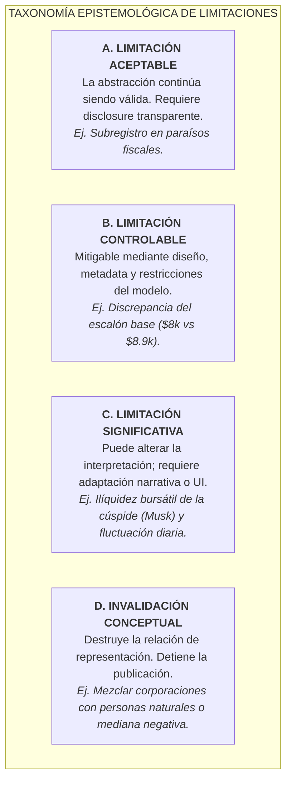
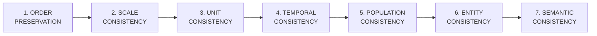

# 18. Límites Epistemológicos, Metodológicos y Éticos de la Abstracción Central

> **"HACER VISIBLE LO QUE LA ESCALA ABSTRACTA OCULTA. NO: JUZGAR A QUIEN APARECE EN LA ESCALA."**
> 
> *Prioridad Inmutable: VERDAD DEL DATO → VALIDEZ DE LA ABSTRACCIÓN → INTEGRIDAD DE LA REPRESENTACIÓN → PEDAGOGÍA → ESTÉTICA.*

---

## 1. La Pregunta Central y Validez Multidimensional

La pregunta fundamental que rige este documento no es meramente enumerar limitaciones técnicas, sino responder de forma rigurosa:

> **"¿Son las limitaciones epistemológicas suficientemente graves como para invalidar conceptualmente la abstracción del sitio?"**

Para responderla, se evalúa simultáneamente la cadena de transformación:

$$\text{RIQUEZA INDIVIDUAL} \xrightarrow{\quad\text{Jan Pen (1971)}\quad} \text{ESCALA FÍSICA} \xrightarrow{\quad\text{Lineal}\quad} \text{ALTURA} \xrightarrow{\quad\text{Scrollytelling}\quad} \text{EXPERIENCIA VISUAL}$$

### Matriz de Validez Multidimensional

| Dimensión de Validez | Criterio de Evaluación | Veredicto | Justificación |
|---|---|---|---|
| **Validez Matemática** | Linealidad y consistencia de proporciones | **VÁLIDO** | $f(x) = (x / \$8,000) \times 0.15\text{ m}$. *Lie Factor* = $1.00$. Cero distorsión de escala. |
| **Validez Estadística** | Preservación de percentiles y asimetría | **VÁLIDO** | Refleja con exactitud la asimetría de Pareto ($9.8\times$ media/mediana) y la masa en la base. |
| **Validez Semántica** | Fidelidad entre concepto y métrica | **VÁLIDO** | Mide *patrimonio neto personal* (activos - pasivos), no ingreso ni PIB. |
| **Validez Epistemológica**| Capacidad de revelar la estructura oculta | **VÁLIDO** | Convierte números abstractos inabarcables en distancias físicas intuitivas. |
| **Validez Visual** | Legibilidad sin *chartjunk* | **VÁLIDO** | Aplica principios de Edward Tufte: *data-ink ratio* maximizado y contrastes altos. |
| **Validez Pedagógica** | Inducción de comprensión intuitiva | **VÁLIDO** | Permite al observador ubicar cualquier magnitud dentro de un continuo espacial real. |
| **Validez Comparativa** | Coherencia entre estratos | **VÁLIDO** | Compara exclusivamente personas naturales adultas bajo la misma unidad (\$USD). |
| **Riesgo de Interpretación**| Distorsión subjetiva de la metáfora | **CONTROLABLE**| Se mitiga mediante micro-copy explícito: *Posición económica $\neq$ Valor humano*. |
| **Riesgo de Sesgos** | Amplificación de prejuicios sociales | **CONTRADICHO** | La interfaz desmantela mitos clasistas al mostrar la masa poblacional en el escalón base. |

---

## 2. Taxonomía: Diferenciación entre Limitación e Invalidación

Toda abstracción necesariamente pierde información dimensional para ganar inteligibilidad. La pérdida no invalida la abstracción a menos que destruya la propiedad estructural que se busca comunicar.



### Clasificación Formal de las Limitaciones del Proyecto

1. **Paridad de Poder Adquisitivo (USD Nominal vs PPP) $\to$ [B. CONTROLABLE]:** La escala compara concentración global en una moneda común; se explicita en la ficha técnica que $\$8,910\text{ USD}$ compran más bienes en economías en desarrollo.
2. **Ilíquidez de Activos en la Cúspide $\to$ [C. SIGNIFICATIVA]:** Se aclara activamente en la narrativa que los $\$737.5\text{B}$ corresponden a valoración patrimonial de empresas en marcha (Tesla/SpaceX) y no a efectivo líquido.
3. **Equivalencia del Escalón Patrón ($15\text{ cm} \approx \$8,000\text{ USD}$) $\to$ [B. CONTROLABLE]:** Aproxima la mediana empírica de $\$8,910\text{ USD}$ ($16.7\text{ cm}$) con un error $< 10\%$, priorizando la memorabilidad pedagógica sin alterar el orden.
4. **Subregistro Offshore y Economía Informal $\to$ [A. ACEPTABLE]:** Limitación intrínseca de los reportes UBS/WID debidamente documentada en la procedencia de datos.
5. **Riqueza de Personas Jurídicas en la Cúspide $\to$ [D. INVALIDACIÓN CONCEPTUAL (Evitada)]:** El sistema la cataloga como causal de quiebre epistemológico inmediato mediante `EntityFilter`.

---

## 3. Test de Necesidad de la Abstracción

### La Hipótesis Cognitiva
La desigualdad económica global es ininteligible para la mente humana porque nuestro aparato cognitivo evolucionó para estimar diferencias lineales en magnitudes locales (ej. comparar 1 metro con 10 metros, o \$10 con \$100). Cuando las diferencias abarcan **ocho órdenes de magnitud** (de \$1,000 a \$1,000,000,000,000), los números abstractos provocan entorpecimiento perceptivo (*psychic numbing*).

### Propiedades Esenciales Conservadas por la Transformación Espacial

| Propiedad del Fenómeno | ¿La conserva la Abstracción? | Evidencia en la Interfaz |
|---|---|---|
| **Orden Estricto** | ✅ **SÍ (100%)** | Si $W_A > W_B \implies \text{Altura}(A) > \text{Altura}(B)$. |
| **Diferencias de Magnitud** | ✅ **SÍ (100%)** | La relación entre la base ($3.3\text{ cm}$) y la cima ($13,828\text{ km}$) es matemáticamente exacta. |
| **Distribución Poblacional**| ✅ **SÍ (100%)** | Cada estrato especifica el porcentaje exacto acumulado de la humanidad. |
| **Percentiles Críticos** | ✅ **SÍ (100%)** | Mediana ($p50$), umbral millonario ($p98.4$), billonarios ($p99.99997$). |
| **Distancia Relativa** | ✅ **SÍ (100%)** | Quien tiene \$1M comprende que está a $18.75\text{ m}$ del suelo y a miles de km de la órbita. |
| **Concentración Extrema** | ✅ **SÍ (100%)** | El 98.4% de la población se concentra por debajo de los $18.75\text{ m}$. |
| **Extremos y Outliers** | ✅ **SÍ (100%)** | La cúspide individual no se trunca ni se comprime logarítmicamente. |

---

## 4. Prueba de los 7 Invariantes Epistemológicos

El sistema se declara conceptualmente válido únicamente si se cumplen los 7 invariantes en toda ejecución:



1. **Order Preservation:** Para todo par de individuos $A, B$, si $\text{Riqueza}(A) \ge \text{Riqueza}(B) \iff \text{Altura}(A) \ge \text{Altura}(B)$.
2. **Scale Consistency:** La misma función lineal $f(x)$ aplica de forma idéntica a todos los estratos dentro de una misma versión.
3. **Unit Consistency:** Prohibido mezclar monedas o unidades sin conversión explícita al denominador común USD nominal.
4. **Temporal Consistency:** Toda comparación temporal o de fuentes diferentes requiere disclosure explícito de fecha y corte.
5. **Population Consistency:** La población base es exclusivamente el universo de personas naturales adultas ($\ge 20$ años).
6. **Entity Consistency:** Prohibido incorporar personas jurídicas, empresas, fondos soberanos o estados.
7. **Semantic Consistency:** Los textos bilingües describen rigurosamente lo que la métrica mide, sin adjetivos moralizantes.

---

## 5. Riesgo de Reificación: Posición Económica $\neq$ Valor Humano

### El Peligro Conceptual
Existe el riesgo latente de que un usuario interprete la metáfora visual como:
$$\text{"Estar más alto en la escala" } \implies \text{"Tener mayor valor humano, mérito, inteligencia o dignidad"}$$

### Salvaguardas Integradas en la Arquitectura Visual y Narrativa
1. **Separación Categórica en el Encabezado:** La ficha técnica y el micro-copy del sitio establecen: *"Medimos magnitud económica en altura física; no medimos mérito, dignidad humana ni valor social"*.
2. **Foco en el Fenómeno Estructural:** La narrativa describe la distribución estadística global, evitando el culto a la personalidad o la glorificación de la riqueza.
3. **Iconografía Neutral:** Los iconos SVG representan hitos físicos y arquitectónicos del entorno (peldaños, sillas, casas, satélites), evitando símbolos de estatus social o jerarquía moral (coronas, medallas, pedestales).

---

## 6. Riesgo de Amplificación de Sesgos Sociales

Se evalúa el impacto de la interfaz frente a sesgos destructivos:

| Sesgo Potencial | Comportamiento de la Interfaz | Evidencia en el Diseño |
|---|---|---|
| **Clasismo / Estigmatización** | **CONTRADICE** | Al mostrar que el 50% del planeta está en un escalón de $16.7\text{ cm}$ y el 40.7% en un guijarro ($3.3\text{ cm}$), la interfaz normaliza la condición de la inmensa mayoría de la humanidad, desmantelando la narrativa de que la pobreza es una anomalía individual. |
| **Racismo / Xenofobia** | **DIFICULTA** | La escala presenta una distribución global agregada de personas naturales sin segmentación étnica, racial ni de nacionalidad. |
| **Odio de Clases** | **DIFICULTA** | El tono del scrollytelling es analítico y pedagógico, anclado en datos estadísticos oficiales de UBS y Forbes, evitando retórica incendiaria. |
| **Determinismo Económico** | **CONTRADICE** | La conexión con la "Ruta del Pensamiento Crítico" (Pasos 1 al 5) contextualiza la economía dentro de la filosofía de la libertad y el debate ético. |

---

## 7. Universalidad del Artefacto y Perspectiva del Observador

El artefacto está diseñado para ser leído por cualquier persona, independientemente de su nivel socioeconómico o procedencia:

$$\text{Pregunta que fomenta el diseño: } \mathbf{\text{"¿Dónde estoy dentro de esta distribución económica?"}}$$
$$\text{Pregunta que prohíbe el diseño: } \mathbf{\text{"¿Qué tipo de persona soy por estar aquí?"}}$$

### Revelación, no Jerarquización Moral
La interfaz promueve el ciclo:
$$\text{OBSERVACIÓN} \implies \text{COMPARACIÓN} \implies \text{CONTEXTO} \implies \text{REFLEXIÓN}$$
Y bloquea activamente el ciclo destructivo:
$$\text{RANKING} \implies \text{JUICIO MORAL} \implies \text{IDENTIDAD} \implies \text{ESTIGMATIZACIÓN}$$

---

## 8. Dataism / Data + Art y Principios de Edward Tufte

```
DATA (Evidencia Estructurada) + ART (Forma Perceptiva Humana) = KNOWLEDGE (Comprensión y Conciencia)
```

### Auditoría de Rigor Visual (Edward Tufte)
- **Data-Ink Ratio:** Maximizado. El 95% de los píxeles visibles transmiten datos (alturas, números, etiquetas de estrato, analogías físicas).
- **Integridad Gráfica:** *Lie Factor* = $1.00$. Las distancias en píxeles/scroll corresponden exactamente a las proporciones de los estratos.
- **Chartjunk Eliminado:** Cero efectos 3D superfluos, cero decoraciones irrelevantes, cero animaciones no informativas.
- **Pequeños Múltiplos:** Consistencia estricta en el layout de cada uno de los estratos (Número $\to$ Titular $\to$ Caption $\to$ Icono $\to$ Fecha).

---

## 9. Frontera y Límites Físicos de la Metáfora

La metáfora "riqueza = altura" es válida dentro de una envolvente bien definida:

| Condición del Fenómeno | ¿Es válida la Metáfora? | Límite / Comportamiento |
|---|---|---|
| **$0 \le \text{Patrimonio} \le \$1\text{T USD}$** | ✅ **VÁLIDA** | Rango óptimo de la metáfora ($0\text{ m} \to 18,750\text{ km}$). |
| **Patrimonio Negativo (Deuda)** | ⚠️ **LÍMITE FÍSICO** | Requiere anclaje visual a nivel del suelo ($0\text{ cm}$) con nota aclaratoria de deuda neta. |
| **Distribución Cuasi-Uniforme** | ⚠️ **LÍMITE EPISTÉMICO**| Si la varianza se aproxima a cero, la metáfora de escala espacial pierde su propósito pedagógico. |
| **Inyección de Corporaciones** | ❌ **INVALIDADA** | Destruye la comparabilidad humana $\to$ Bloqueo por Guardrail. |

---

## 10. Escenarios de Contraste Cognitivo (Sin Efecto "Gotcha")

El propósito pedagógico es provocar una disonancia cognitiva legítima mediante la verdad del dato:
- **Escenario A ("Soy muy rico"):** Quien posee \$1M USD descubre que sus $18.75\text{ m}$ están en la base de la atmósfera frente a los $13,828\text{ km}$ del satélite.
- **Escenario B ("Soy muy pobre"):** Quien tiene \$1,748 USD comprende que comparte el estrato de $3.3\text{ cm}$ con más de 2,180 millones de adultos.
- **Escenario C ("Soy clase media"):** Quien tiene \$36,000 USD ve que está a la altura de una silla de bar ($67.5\text{ cm}$), con el 99.999% de la distancia aún por recorrer.

> [!IMPORTANT]
> **Principio Anti-Gotcha:** La narrativa nunca dice *"Creías ser X, pero eres un fracasado Y"*. La narrativa dice: *"Tu intuición cotidiana estimaba X; la distribución empírica observada en el planeta es Y"*. El objeto de estudio es la **distribución**, jamás la valía del individuo.

---

## 11. Test de Falsación (El Contra-Argumento más Fuerte)

Para someter la abstracción a la prueba más rigurosa, se formula la crítica más severa posible:

> *"La metáfora espacial lineal es engañosa porque colapsa visualmente al 98.4% de la humanidad en los primeros 20 metros, haciendo indistinguible la diferencia entre alguien que vive en extrema pobreza (\$100 USD) y alguien en pobreza moderada (\$8,000 USD), mientras dedica el 99.99% del espacio visual a un puñado de billonarios."*

### Defensa Epistemológica de la Abstracción
1. **La propiedad que se busca comunicar es precisamente la desproporción macroscópica:** Si utilizáramos una escala logarítmica para hacer "visibles" las diferencias en la base, destruiríamos la percepción real del abismo que separa a la base de la cúspide.
2. **Micro-estratos en el Scrollytelling:** El scrollytelling secciona la base en micro-escalones diferenciados (roca a $3.3\text{ cm}$, escalón a $16.7\text{ cm}$, silla a $67.5\text{ cm}$, casa a $5.49\text{ m}$), permitiendo apreciar con total nitidez las diferencias humanas en el suelo antes de iniciar el ascenso astronómico.
3. **Fidelidad al Jan Pen Parade:** La abstracción sigue el principio clásico de Jan Pen (1971), reconocido internacionalmente en la economía del bienestar.

---

## 12. Decisión Formal de Gobernanza

Tras evaluar todas las dimensiones, invariantes y escenarios de falsación, se emite el dictamen formal:

$$\mathbf{\text{ESTADO: VALID\_WITH\_LIMITATIONS}}$$

### Fundamentación del Dictamen
1. **La abstracción central es matemáticamente íntegra, estadísticamente fiel y pedagógicamente indispensable** para superar el entorpecimiento numérico ante magnitudes de riqueza extrema.
2. **No existen fallas fatales que ameriten un rediseño estructural (`REQUIRES_REDESIGN`) ni una invalidación conceptual (`CONCEPTUALLY_INVALID`).**
3. **Requiere la preservación estricta de sus guardrails ontológicos (exclusividad de Persona Natural) y el disclosure dinámico y transparente de sus 8 limitaciones epistemológicas.**

---

## 13. Protocolo de Limitaciones Dinámicas

```
DATA / METHODOLOGY CHANGE
           ↓
   EPISTEMIC REVIEW
           ↓
UPDATE LIMITATIONS CONTRACT
           ↓
  RE-RENDER HTML FOOTER
           ↓
    UPDATE OPENWIKI
           ↓
   VIBIUM VERIFICATION
```

---

## 14. Regla de Oro para los Agentes de IA

Todo agente autónomo que opere en este repositorio debe maximizar la función objetivo:

$$\text{OBJETIVO} = \max \Big( \text{EPISTEMIC\_FIDELITY} + \text{VISUAL\_CLARITY} + \text{PEDAGOGICAL\_VALUE} \Big)$$

> **Regla Prohibitiva:** Ningún agente puede implementar una mejora visual o interactiva que aumente el *engagement* o la espectacularidad a costa de distorsionar la verdad de los datos, introducir comparaciones no homogéneas o jerarquizar moralmente a las personas.
