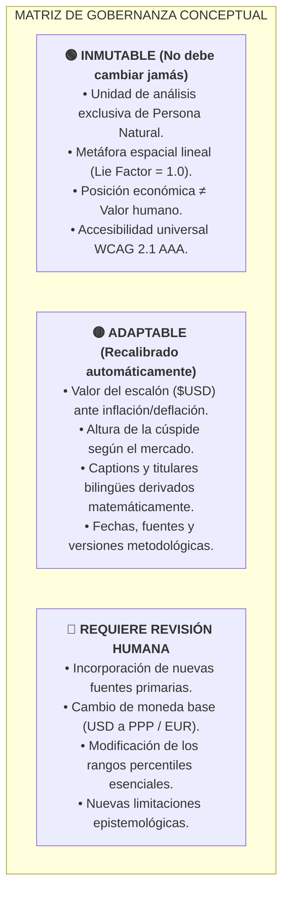

# 19. Baseline Oficial v0.9 y Fase 0: Estabilización de la Abstracción

> **FASE ACTUAL: PHASE 0 — BASELINE STABILIZATION (HIGH HUMAN-IN-THE-LOOP)**
> 
> *Estado:* `CONGELACIÓN CONCEPTUAL DE LA BASELINE v0.9`
> *Principio Rector:* **UNDERSTAND → STABILIZE → MEASURE → DOCUMENT → TEST → AUTOMATE.**

---

## 1. Declaración de la Baseline Oficial v0.9

Se congela formalmente el estado actual del proyecto como la **BASELINE OFICIAL v0.9**, que servirá como punto de referencia inmutable para evaluar cualquier adaptación, actualización de datos o evolución arquitectónica futura.

### Fuentes y Cifras Canónicas Congeladas
- **Fuente Base 1 (Distribución Poblacional y Mediana):** *UBS Global Wealth Report 2024* (datos a 31 dic 2024).
  - Población mundial adulta ($\ge 20$ años): $5,360,000,000$ personas naturales.
  - Mediana de riqueza por adulto: $\$8,910\text{ USD}$ nominales ($16.7\text{ cm}$ en la escala física).
  - Base del 40.7% de la humanidad: $\$0 - \$10,000\text{ USD}$ (promedio $\$1,748\text{ USD} \to 3.3\text{ cm}$).
- **Fuente Base 2 (Cúspide y Multimillonarios):** *Forbes Real-Time Billionaires* (corte mayo 2026).
  - Total de billonarios globales: $2,891$ personas naturales ($0.00003\%$ de los adultos).
  - Cúspide individual: **Elon Musk** ($\$636\text{B} - \$839\text{B USD}$, promedio $\$737.5\text{B USD} \to 13,828\text{ km}$, Órbita Terrestre Media).
- **Constante de Escala Patrón:** $1\text{ escalón} (15\text{ cm}) \approx \$8,000\text{ USD}$.

---

## 2. Matriz de Estabilidad: Qué Cambia y Qué Permanece

---

## 3. Catálogo de Decisiones: Adaptación Legítima vs. Regresión vs. Invalidación

| Evento | Clasificación | Acción del Sistema |
|---|---|---|
| La mediana global sube a $\$11,200\text{ USD}$ y la cúspide a $\$940\text{B}$ | **Adaptación Legítima (Data Drift)** | Recalibrar `step_usd_value`, reescalar alturas y regenerar textos dinámicamente (`PASS_WITH_ADAPTATION`). |
| Cambio de 8 estratos a 6 estratos según nueva granularidad de UBS/WID | **Adaptación Legítima (Methodological)** | Compilar dinámicamente secciones HTML respetando la gramática visual de Jan Pen. |
| Inyección de un texto estático desactualizado ("UBS dic 2024" en 2030) | **Regresión Semántica** | Fallo en validación semántica en CI (`FAIL_STATIC_RESIDUAL`). |
| Reducción de touch targets a $< 44\text{ px}$ o solapamiento visual | **Regresión de UI/UX** | Intercepción por el Verification Engine de Vibium (`BLOCK_UI_REGRESSION`). |
| Inclusión de una empresa, corporación o fondo soberano en la cúspide | **Conceptual Drift Crítico** | **`GUARDRAIL_BLOCKED_NON_NATURAL_PERSON` $\to$ Detención de publicación.** |
| Mediana global calculada en $\le \$0\text{ USD}$ por colapso de datos | **Invalidación de la Abstracción** | **`ABSTRACTION_LIMIT_REACHED` $\to$ Emisión de `ADAPTATION_FAILED`.** |

---

## 4. Guardrails Operativos de la Baseline

### A. Guardrails Ontológicas
- **Unidad:** Exclusivamente personas naturales adultas.
- **Exclusión Taxativa:** Empresas, corporaciones, organizaciones sin ánimo de lucro, fundaciones, estados, gobiernos y fondos soberanos.
- **Objeto:** Patrimonio neto atribuible al individuo (activos financieros + inmobiliarios personales - pasivos privados).

### B. Guardrails Epistemológicas
- La abstracción documenta lo que mide y lo que no mide.
- Principio fundamental: **`LIMITATION ≠ INVALIDATION`**. Una limitación solo invalida cuando destruye la relación de orden, la masa poblacional en el suelo o la inteligibilidad del abismo hacia la cúspide.
- 8 limitaciones estructuradas activas en la ficha técnica y metadatos.

### C. Guardrails Semánticas
- Cero cadenas estáticas dependientes de datos.
- Captions $s1 \dots sN$ derivados en tiempo de compilación.
- Data Date estructurado dinámicamente: `${SOURCE} · ${PERIOD} · v${VERSION}`.

### D. Guardrails Visuales y Responsive
- $\text{Visual Grammar} = \text{STABLE}$.
- $\text{Visual Parameters} = \text{ADAPTIVE}$.
- Matriz dual obligatoria: $\text{Baseline} \times \text{Mobile (390px)}$ y $\text{Baseline} \times \text{Desktop (1920px)}$.

---

## 5. Simulación de Fuentes Futuras (Test Suite)

La baseline cuenta con generadores y verificadores sintéticos para simular 4 categorías de fuentes futuras sin esperar publicaciones reales:
1. **Drift Moderado:** Encuestas futuras 2028-2038 con variación en billonarios y percentiles normales (`generate-synthetic-data.js`).
2. **Drift Metodológico:** Conversión a PPP, reorganización de percentiles en 6 deciles macro (`tests/three-scenarios.test.mjs` - Escenario 2).
3. **Drift Extremo:** Distribuciones astronómicas, deuda negativa masiva, hiperconcentración (`src/vibium/vibium-extreme-suite.js` - 12 Casos Extremos).
4. **Source Failure:** Datasets vacíos, esquemas corruptos, entidades espurias (`Case 10` y `Case 11`).

---

## 6. Definición de "Done" para Fase 0 (Checklist de Certificación)

- [x] **Abstracción Formalizada:** Jan Pen Parade (1971) espacial lineal con *Lie Factor* = 1.0.
- [x] **Unidad de Análisis Restringida:** Persona Natural exclusiva vía `EntityFilter`.
- [x] **Entidades Jurídicas Excluidas:** Prohibición en adaptadores, modelo canónico y guardrails.
- [x] **Definición de Riqueza Documentada:** Patrimonio neto personal por adulto.
- [x] **Limitaciones Epistemológicas Formalizadas:** 8 limitaciones estructuradas e inyectadas dinámicamente.
- [x] **Límites de la Abstracción Definidos:** Regla de límites físicos, visuales y epistémicos.
- [x] **Copy 100% Dinámico:** Captions y fechas calculados en compilación sin residuos estáticos.
- [x] **Mobile First Certificado:** 390x844 sin scroll horizontal y touch targets $\ge 44\text{ px}$.
- [x] **Desktop Certificado:** 1920x1080 con navegación accesible por teclado y contraste AAA.
- [x] **Cero Overlaps ni Truncamientos:** Verificado por JSDOM y suite Vibium.
- [x] **Vibium Verification Layer Integrada:** Dual runner con generación determinística de artefactos ZIP.
- [x] **3 Escenarios de Drift Superados:** Probable, Metodológico y Caótico (100% Passing).
- [x] **Fuentes Futuras Simulables:** 25/25 iteraciones de robustez sintética aprobadas.
- [x] **README.md Actualizado:** Documentación completa del proyecto y ecosistema.
- [x] **OpenWiki Actualizado:** 20 documentos de verdad documental indexados.
- [x] **Pipeline Inicial de CI Existente:** GitHub Actions workflows configurados.
- [x] **Roadmap de Autonomía Documentado:** Fases 0 a 7 formalizadas en OpenWiki 20.
