# 20. Roadmap de Automatización Progresiva y Gobernanza Operacional DAO-Like

> **"NO CONSTRUYAS TODAVÍA UN SISTEMA QUE PRETENDA SER AUTÓNOMO. CONSTRUYE PRIMERO UN SISTEMA QUE PUEDA DEMOSTRAR QUE MERECE SER AUTÓNOMO."**
> 
> *Evolución de Confianza:* **HUMAN → HUMAN + AUTOMATION → HUMAN + AGENTS → SUPERVISED AGENTS → BOUNDED AUTONOMY → DAO-LIKE OPERATION.**

---

## 1. El Roadmap General de 7 Fases

```mermaid
graph TD
    F0["<b>FASE 0: BASELINE STABILIZATION</b><br><i>[ESTADO ACTUAL]</i><br>High Human-in-the-Loop. Contratos congelados, guardrails ontológicas, Vibium dual y suites sintéticas."]
    F1["<b>FASE 1: DETERMINISTIC CI</b><br>Build, Unit Tests, Data/Schema Validation, i18n, Vibium automatizado en GitHub Actions. Deploy con Human Approval."]
    F2["<b>FASE 2: DRIFT DETECTION ENGINE</b><br>Detección automatizada de Data, Semantic, Methodological y Conceptual Drift. Generación de Drift Report sin mutación."]
    F3["<b>FASE 3: AGENTIC ADAPTATION</b><br>Agentes interpretan nuevas fuentes, adaptan copy bilingüe y recalibran escalas. Generan Pull Request para revisión humana."]
    F4["<b>FASE 4: CLOSED-LOOP TUNING</b><br>Ciclo científico: Observe → Hypothesize → Modify → Test → Measure → Rank → Retain/Revert. Cero bucles abiertos."]
    F5["<b>FASE 5: SOURCE RESEARCH AGENT</b><br>Agente especializado en descubrimiento, validación de procedencia y extracción de fuentes primarias candidatas."]
    F6["<b>FASE 6: AGENTIC SOURCE INGESTION</b><br>Descubrimiento, captura, normalización, prueba, adaptación y verificación con mínima intervención humana."]
    F7["<b>FASE 7: DAO-LIKE OPERATION</b><br>Autonomía operacional delimitada con gobernanza estricta, auditoría inmutable en Git/OpenWiki y reversibilidad total."]

    F0 --> F1 --> F2 --> F3 --> F4 --> F5 --> F6 --> F7
```



---

## 2. Descripción Detallada de Cada Fase y Criterios de Madurez

### Fase 0 — Baseline Stabilization (High Human-in-the-Loop) — [ESTADO ACTUAL]
- **Objetivo:** Congelar el contrato conceptual, validar límites de la abstracción, integrar guardrails ontológicas/epistemológicas, suite Vibium (Mobile/Desktop) y pruebas de 12 casos extremos.
- **Autoridad:** El humano tiene autoridad absoluta sobre cada cambio conceptual, metodológico o arquitectónico.
- **Criterio de Madurez para avanzar a Fase 1:** 100% de tests unitarios, contratos y suite Vibium pasando con estabilidad determinística.

### Fase 1 — Deterministic CI
- **Objetivo:** Automatizar en GitHub Actions la ejecución de `npm test`, validación de schemas JSON, compilación HTML, auditoría i18n y generación de evidencias determinísticas.
- **Autoridad:** CI ejecuta y valida; la publicación a GitHub Pages requiere aprobación humana (*Environment Protection Rule*).
- **Criterio de Madurez:** Cero falsos negativos en 50 ejecuciones consecutivas de CI.

### Fase 2 — Drift Detection Engine
- **Objetivo:** El sistema ingiere payloads externos y produce de forma autónoma un `DriftReport` estructurado clasificando el tipo y severidad del cambio sin tocar el código de visualización.
- **Autoridad:** El sistema emite alertas y recomendaciones; no aplica cambios autónomos.
- **Criterio de Madurez:** Precisión $> 98\%$ en clasificación de drift sintético sin falsas alarmas de quiebre epistemológico.

### Fase 3 — Agentic Adaptation
- **Objetivo:** El agente de IA (Gemini / Motor Determinista) genera propuestas de adaptación de copy, recalibración de alturas y actualización de limitaciones en forma de *Proposed Changes* / *Pull Requests*.
- **Autoridad:** El agente propone cambios controlados; CI los valida; el humano aprueba el merge.

### Fase 4 — Closed-Loop Tuning
- **Objetivo:** Implementación del protocolo experimental formal:
  $$\text{OBSERVE} \to \text{HYPOTHESIZE} \to \text{MODIFY} \to \text{TEST} \to \text{MEASURE} \to \text{RANK} \to \text{RETAIN / REVERT}$$
- **Autoridad:** Todo intento termina en uno de cuatro estados formales: `ACCEPTED`, `REJECTED`, `DEFERRED`, `INVALIDATED`.

### Fase 5 — Source Research Agent
- **Objetivo:** Agente autónomo que sondea APIs de UBS, WID y Forbes, compara versiones metodológicas y genera reportes de *Source Candidates* con cálculo de confianza.
- **Autoridad:** Genera candidatos para homologación; no los inyecta en producción directamente.

### Fase 6 — Agentic Source Ingestion
- **Objetivo:** Integración continua del ciclo de vida de datos con mínima fricción humana para variaciones ordinarias de datos (Data Drift moderado).

### Fase 7 — DAO-Like Operation (Autonomía Delimitada)
- **Objetivo:** Sistema auto-gobernado dentro de su frontera ontológica:
  $$\text{AUTONOMOUS EXECUTION} + \text{EXPLICIT GOVERNANCE} + \text{AUDITABILITY} + \text{REVERSIBILITY} + \text{BOUNDED AUTHORITY}$$

---

## 3. Matriz de Gobernanza y Delegación de Autoridad

| Nivel de Riesgo | Categoría de Cambio | Autoridad Decisoria | Mecanismo de Control |
|---|---|---|---|
| 🟢 **Bajo Riesgo** | Recalibración numérica de alturas, actualización de fechas de fuentes idénticas. | **Agente Autónomo** | CI determinístico + Validador matemático. |
| 🟡 **Riesgo Medio** | Generación de narrativa bilingüe, reformulación de captions pedagógicos, ajuste de deciles ($N=3..12$). | **Agente + Verificación Vibium** | Suite dual Mobile/Desktop + Guardrails sintácticos. |
| 🔴 **Alto Riesgo** | Cambio de moneda base (USD a PPP / EUR), redefinición del concepto de riqueza. | **Aprobación Humana Obligatoria** | Pull Request con revisión de experto. |
| ⛔ **Cambio Conceptual** | Alteración de la unidad de análisis (intentos de incluir empresas o estados). | **Humano Exclusivo / Bloqueo** | **Guardrail Bloqueante (`GUARDRAIL_BLOCKED_NON_NATURAL_PERSON`).** |
| ⛔ **Cambio de Abstracción** | Sustitución de la metáfora de altura espacial por gráficos logarítmicos o mapas. | **Humano Exclusivo** | Invariante contractual inmutable. |
| ⛔ **Cambio de Seguridad** | Modificación de tokens, llaves de API o permisos de despliegue. | **Humano Exclusivo** | Secretos aislados en GitHub Environments. |

---

## 4. Principio Anti-Autoautorización (No Self-Authorization)

> **REGLA FUNDAMENTAL: $\mathbf{\text{AGENT} \neq \text{AUTHORITY}}$**

Queda taxativamente prohibido que un agente de IA realice la siguiente secuencia:
1. Cambiar una regla de negocio o guardrail.
2. Modificar el código de test que valida dicha regla.
3. Declarar que la prueba pasó exitosamente.
4. Auto-aprobar y publicar el cambio a producción.

Todo cambio en las reglas de verificación o en los guardrails epistemológicos requiere validación externa o aprobación humana explícita.

---

## 5. Reversibilidad Total y Registro de Auditoría

Toda acción autónoma del sistema debe ser 100% reversible:
- **Snapshot Criptográfico:** Cada compilación asocia el `dataset_id` (hash SHA-256) con el commit de Git.
- **Rollback Instantáneo:** Si Vibium o el usuario detectan una degradación semántica posterior al despliegue, el sistema puede revertir con un solo comando al estado previo verificado:
  ```bash
  git revert HEAD && git push origin master
  ```

---

## 6. Evaluación de Infraestructura Futura: GitHub Actions vs. Docker

| Criterio | GitHub Actions (Fases 0 a 3) | Contenedores Docker (Fases 4 a 7) |
|---|---|---|
| **Justificación** | Suficiente, ligero, integrado nativamente con GitHub Pages y secrets. | Se incorporará cuando existan dependencias multi-agente complejas o scrapers con browsers aislados. |
| **Reproducibilidad** | Alta mediante `package-lock.json` y Node 20 LTS en Ubuntu runner. | Total y aislada mediante imágenes OCI inmutables. |
| **Adopción** | **Activa de inmediato.** | **Diferida a Fases 4+ según necesidad real.** |
