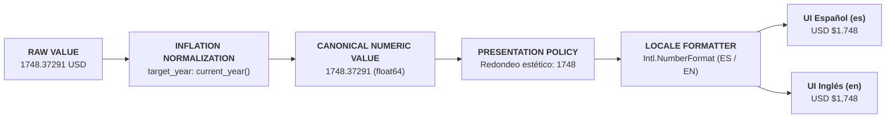

# 21. Invariantes Globales: Año Objetivo Dinámico y Formato Numérico i18n Centralizado

> **"EL DATO ORIGINAL ES INMUTABLE. LA NORMALIZACIÓN ES DINÁMICA. EL AÑO OBJETIVO ES SIEMPRE EL AÑO PRESENTE. EL CÁLCULO MANTIENE ALTA PRECISIÓN INTERNA. LA PRESENTACIÓN REDONDEA DE MANERA ESTÉTICA Y LOCALIZADA."**
> 
> *Pipeline Arquitectónico:* **SOURCE → FACT → NORMALIZED FACT → PRESENTATION POLICY → LOCALE → UI.**

---

## 1. Invariante 1: Año Objetivo = Año Presente (`current_year()`)

La normalización monetaria y temporal del proyecto está sujeta a una regla estricta de conciencia temporal:

$$\mathbf{\text{target\_year} = \text{new Date().getFullYear()}}$$

### Principios Operativos
1. **Cero Años Hardcodeados:** Ningún componente, pipeline o script puede tener un año objetivo estático (como `2026`). El año objetivo se deriva dinámicamente del runtime de ejecución.
2. **Preservación del Dato Histórico Crudo:**
   - **`SOURCE DATE`:** Fecha histórica inmutable reportada por la fuente primaria (ej. `"2024-12-31"` para UBS o `"2026-05-01"` para Forbes).
   - **`CURRENT DATE`:** Fecha de ejecución del pipeline en formato ISO (`YYYY-MM-DD`).
   - **`CURRENT YEAR`:** Año calendario presente en el momento de la ejecución.
3. **Poder Adquisitivo del Año Presente:**
   - Cuando el sistema se ejecuta en 2026: normaliza y compara el dato de 2024 al poder adquisitivo de 2026.
   - Cuando el sistema se ejecute en 2027: normaliza automáticamente al poder adquisitivo de 2027.
   - La fecha de la fuente **nunca se muta**; el cambio de año objetivo únicamente afecta el valor normalizado y los metadatos de ejecución.

---

## 2. Invariante 2: Formato Numérico Centralizado (i18n + Redondeo Estético)

El formateo numérico no es un detalle estético de la UI; es un **guardrail de integridad semántica y cognición**.

### Reglas Categóricas
1. **Separación de Responsabilidades:**
   - **`NUMERIC VALUE`:** Cálculo interno de alta precisión (números flotantes en memoria).
   - **`DISPLAY VALUE`:** Redondeo estético + formateo localizado + presentación visual.
   - **Prohibición Absoluta:** *Nunca utilizar el valor formateado (string) para cálculos posteriores.*
2. **Principio CURRENCY ≠ LOCALE:**
   - La moneda es la unidad económica (`USD`).
   - El locale es la convención regional de puntuación (`es` vs `en`).
   - Un valor de $\$1,748.50\text{ USD}$ en una interfaz `es-419` se formatea como `USD $1.748,50`, conservando la denominación en dólares pero adoptando la convención decimal y de miles hispana.

---

## 3. Matriz de Convenciones por Locale

| Concepto | Entrada Numérica | Formato Español (`es-ES` / `es-419`) | Formato Inglés (`en-US`) |
|---|---|---|---|
| **Separador de Miles** | `1748` | `1.748` (Punto) | `1,748` (Coma) |
| **Separador Decimal** | `1748.5` | `1.748,50` (Coma) | `1,748.50` (Punto) |
| **Moneda** | `1748` (`USD`) | `USD $1.748` | `USD $1,748` |
| **Alturas Orbitales** | `13828125` m | `13.828,13 km` | `13,828.13 km` |
| **Alturas Intermedias** | `0.675` m | `67,5 cm` | `67.5 cm` |
| **Alturas de Base** | `0.032775` m | `3,3 cm` | `3.3 cm` |
| **Grandes Magnitudes** | `737500000000` | `737,5B` | `737.5B` |
| **Millones** | `3700000` | `3,7M` | `3.7M` |
| **Porcentajes** | `40.7` | `40,7%` | `40.7%` |
| **Fracciones Mínimas** | `0.00003` | `< 0,0001%` | `< 0.0001%` |

---

## 4. Política de Redondeo Estético y Falsa Precisión

Queda prohibido presentar cifras con precisión artificial que sobrecarguen la cognición del usuario o simulen una exactitud estadística inexistente en encuestas macroeconómicas:

* **Inaceptable:** `USD $1.748,37291` o `13.828,12500000 km`.
* **Aceptable y Estético:** `USD $1.748` y `13.828,13 km`.
* **Regla de Magnitudes:**
  - Valores $\ge 10^9$: Expresar en miles de millones / billones ($B$) con máximo 1 o 2 decimales significativos (`737,5B`).
  - Valores $\ge 10^6$: Expresar en millones ($M$) con máximo 1 decimal (`3,7M`).
  - Valores $\ge 10^4$: Expresar en miles ($k$) redondeados al entero (`36k`).

---

## 5. Implementación Centralizada en Código

Todo el formateo numérico del ecosistema está centralizado en:
* **Módulo:** [`src/i18n/number-formatter.js`](file:///c:/Dev/Igualdad-Economica-2025/src/i18n/number-formatter.js)
  * `NumberFormatter.getCurrentYear()`
  * `NumberFormatter.getTemporalContext(sourceDate)`
  * `NumberFormatter.formatNumber(val, locale, options)`
  * `NumberFormatter.formatCurrency(val, currency, locale, options)`
  * `NumberFormatter.formatMagnitude(val, locale)`
  * `NumberFormatter.formatHeight(meters, locale)`
  * `NumberFormatter.formatPercentage(pct, locale)`

---

## 6. Suite de Pruebas Obligatorias

El sistema cuenta con pruebas automatizadas en CI para certificar ambos invariantes:
1. **[`tests/unit/number-formatter.test.mjs`](file:///c:/Dev/Igualdad-Economica-2025/tests/unit/number-formatter.test.mjs):**
   - Separadores decimales y de miles cruzados en ES y EN.
   - Formato monetario sin mutar la divisa (`USD`).
   - Abreviaciones $k, M, B$ y trillones.
   - Alturas físicas ($km, m, cm$).
   - Manejo de cero, negativos y números mínimos.
2. **[`tests/unit/temporal-normalization.test.mjs`](file:///c:/Dev/Igualdad-Economica-2025/tests/unit/temporal-normalization.test.mjs):**
   - Derivación dinámica del año presente en runtime.
   - Preservación de la fecha original de la fuente.
   - Inexistencia de años hardcodeados en el pipeline de compilación.
