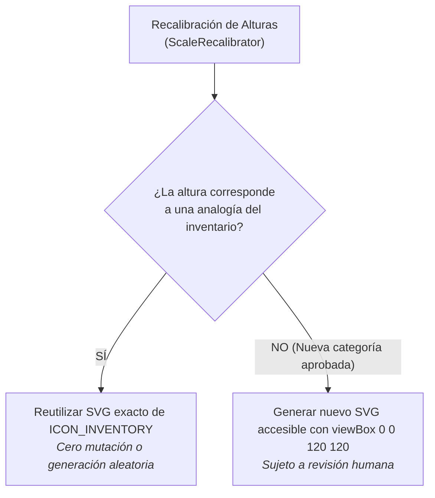

# 22. Inventario Canónico de Assets Visuales y Guardrails de Iconos SVG

> **"LOS ELEMENTOS VISUALES PEDAGÓGICOS (SATÉLITE, COHETE, EDIFICIO, ESCALERA, CASA, SILLA DE BAR, ESCALÓN, ROCA) FORMAN PARTE DEL CONTRATO DE ABSTRACCIÓN. NO DEBEN SER MUTADOS NI REEMPLAZADOS POR ELEMENTOS GENÉRICOS."**
> 
> *Regla de Inventario:* **SI LA ANALOGÍA EXISTE EN EL INVENTARIO → REUTILIZAR EL ICONO CANÓNICO. NUNCA REINVENTAR O DEGRADAR EL ARTEFACTO VISUAL.**

---

## 1. El Inventario Canónico de Iconos SVG

El proyecto cuenta con un inventario inmutable centralizado en [`src/assets/icon-inventory.js`](file:///c:/Dev/Igualdad-Economica-2025/src/assets/icon-inventory.js) que contiene los 8 assets vectoriales optimizados:

| ID | Estrato | Analogía Física | Rango de Altura | Descripción Estilística |
|---|---|---|---|---|
| `svg-s1` | **s1 (Cúspide)** | **Satélite en órbita** | $\ge 100,000\text{ m}$ | Órbita elíptica inclinada con satélite emisor y cruz orbital. |
| `svg-s2` | **s2 (Billonarios)** | **Cohete en la estratosfera** | $10,000\text{ m} - 100,000\text{ m}$ | Fuselaje aerodinámico, alerones y estela de propulsión segmentada. |
| `svg-s3` | **s3 (Millonarios)** | **Rascacielos moderno** | $30\text{ m} - 1,000\text{ m}$ | Estructura vertical con cuadrícula de ventanas y puerta de acceso. |
| `svg-s4` | **s4 (Umbral)** | **Escalera de 125 escalones** | $10\text{ m} - 30\text{ m}$ | Peldaños equidistantes y montantes verticales. |
| `svg-s5` | **s5 (Media Alta)** | **Casa de dos pisos** | $2\text{ m} - 10\text{ m}$ | Techo a dos aguas, ventanas superiores y puerta principal. |
| `svg-s6` | **s6 (Mayoría)** | **Silla alta de bar** | $0.4\text{ m} - 2\text{ m}$ | Asiento circular, reposapiés anular y patas reforzadas. |
| `svg-s7` | **s7 (Mediana)** | **Un solo escalón de escalera** | $0.08\text{ m} - 0.4\text{ m}$ | Huella y contrahuella del peldaño patrón ($\sim 15\text{ cm}$). |
| `svg-s8` | **s8 (Base)** | **Roca pequeña / Guijarro** | $< 0.08\text{ m}$ | Contorno orgánico en el suelo, textura y línea de tierra. |

---

## 2. Guardrails de Consistencia Visual y Reutilización

### Reglas Categóricas
1. **Reutilización Obligatoria:** Cuando `ScaleRecalibrator` o cualquier adaptador asigna una analogía existente (ej. Silla de bar, Casa, Roca, Satélite), **debe consumir el SVG del inventario**.
2. **Prohibición de Degradación Visual:** Ningún test ni agente de IA puede sustituir los iconos canónicos por formas geométricas genéricas o círculos abstractos.
3. **Parámetros Estilísticos Estándar:**
   - `viewBox="0 0 120 120"`
   - `fill="none"`
   - `stroke="currentColor"`
   - `stroke-width="4"` (con acentos de 2.5 a 3.5 y transparencias `opacity=".15"` a `.85`).

---

## 3. Aislamiento de Pruebas y Protección de la Línea Base

Para prevenir que suites sintéticas o generadores aleatorios sobrescriban silenciosamente la línea base oficial (`OpenWiki/spec/data.json` y `Escala-visual-de-riqueza-mundial.html`):

1. **Restauración Obligatoria:** Todas las suites de robustez implementan bloques `finally` que restauran los archivos originales de forma incondicional.
2. **Sincronización Inmediata:** Tras cualquier ciclo de pruebas, el pipeline ejecuta `node OpenWiki/scripts/apply-data.js` para asegurar que el HTML compilado refleje con exactitud la línea base oficial (Elon Musk, UBS 2024, 8 estratos canónicos).
