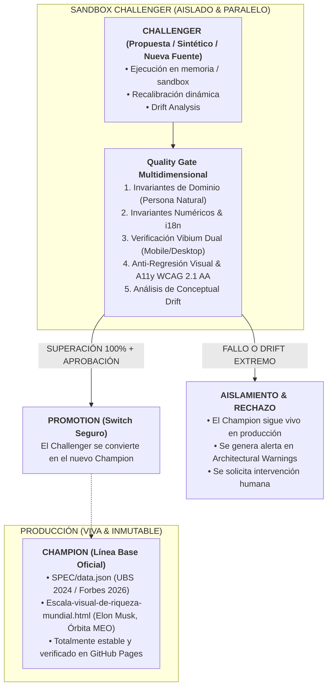

# 23. Arquitectura Champion / Challenger y Sandboxes Aislados de Prueba

> **"EL CHAMPION EN PRODUCCIÓN ES SAGRADO E INMUTABLE HASTA QUE UN CHALLENGER DEMUESTRE EXCELENCIA TOTAL EN UN SANDBOX AISLADO."**
> 
> *Regla de Oro de Fase 0:* **NINGUNA SUITE DE PRUEBAS NI SIMULACIÓN SINTÉTICA PUEDE ESCRIBIR DIRECTAMENTE SOBRE LOS ARTEFACTOS DE PRODUCCIÓN (`SPEC/data.json` Y `Escala-visual-de-riqueza-mundial.html`).**

---

## 1. El Paradigma Champion / Challenger (A/B & Blue-Green)

En la arquitectura de gobernanza y despliegue del sistema:

---

## 2. Los Dos Roles del Sistema

### A. El Champion (Producción Oficial)
- **Estado Actual:** Baseline Oficial v0.9 (Elon Musk, $\$636\text{B} - \$839\text{B USD} \to 13.828,13\text{ km}$, UBS Report 2024).
- **Invariante de Producción:** Se mantiene publicado y sirviendo tráfico en GitHub Pages sin interferencias.
- **Acceso:** **Solo-Lectura** para todas las suites de prueba automáticas, CI y agentes de exploración.

### B. El Challenger (Desafiante en Sandbox)
- **Instanciación:** Toda nueva ejecución de actualización de datos, dataset sintético o propuesta generada por IA se ejecuta en un **entorno aislado (memoria o directorio `artifacts/sandbox/`)**.
- **Compilación Aislada:** El compilador (`HtmlCompiler.compile()`) genera el artefacto en memoria contra la plantilla base, sin tocar el archivo raíz `Escala-visual-de-riqueza-mundial.html`.
- **Certificación Previa:** Un Challenger solo puede reemplazar al Champion si supera el 100% de los quality gates sin una sola regresión.

---

## 3. Manejo de Casos Borde: Conceptual Drifts Extremos

Cuando el mundo exterior sufre cambios macroeconómicos o estadísticos drásticos (ej. hiperinflación global, colapso de divisas, cambios metodológicos radicales en el reporte de UBS):

1. **Invariante de Protección Activa:** El sistema **NUNCA** empuja automáticamente una versión con Conceptual Drift extremo a producción.
2. **Preservación del Champion:** El Champion actual continúa en vivo, asegurando que la experiencia pedagógica y visual no se rompa ni presente artefactos rotos.
3. **Generación de Telemetría y Alerta:**
   - Se emite el evento `DRIFT_CLASSIFICATION = CRITICAL_CONCEPTUAL_DRIFT`.
   - Se congela el Challenger en el registro inmutable de auditoría.
   - Se requiere la aprobación humana explícita según la [Matriz de Gobernanza DAO](./20_ROADMAP_AUTOMATIZACION_PROGRESIVA_Y_GOBERNANZA_DAO.md).

---

## 4. Garantías Implementadas en el Código

1. **[`tests/synthetic-robustness.test.mjs`](file:///c:/Dev/Igualdad-Economica-2025/tests/synthetic-robustness.test.mjs):**
   - Ejecuta 25 iteraciones de estrés sintético de forma 100% aislada en memoria.
   - Cero escrituras en `SPEC/data.json` o `Escala-visual-de-riqueza-mundial.html`.
2. **[`SPEC/scripts/apply-data.js`](file:///c:/Dev/Igualdad-Economica-2025/SPEC/scripts/apply-data.js):**
   - Es el único script autorizado para sincronizar el Champion canónico de producción desde `SPEC/data.json`.
3. **[`src/assets/icon-inventory.js`](file:///c:/Dev/Igualdad-Economica-2025/src/assets/icon-inventory.js):**
   - Garantiza que los elementos visuales del Champion (Satélite, Cohete, Rascacielos, Escalera, Casa, Silla, Escalón, Roca) permanezcan inalterables.
