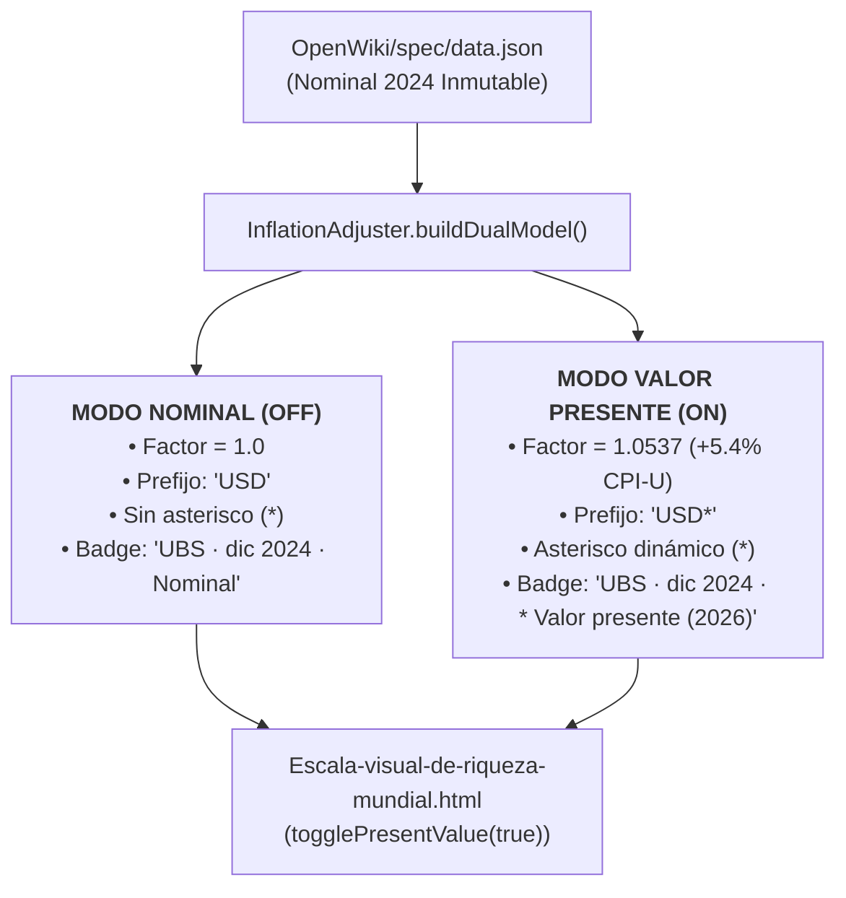

# 24. Toggle Estético de Valor Presente (UI Frosted Glass) y Normalización Inflacionaria

> **"EL DATO NOMINAL HISTÓRICO ES LA EVIDENCIA EMPÍRICA INMUTABLE. EL VALOR PRESENTE ES LA HERRAMIENTA COGNITIVA VIVA. EL USUARIO TIENE EL CONTROL TOTAL DE ALTERNAR AMBAS PERSPECTIVAS EN UN SOLO TOQUE."**

---

## 1. Justificación Pedagógica y Epistemológica

La riqueza histórica reportada por instituciones como UBS (con corte a dic-2024) y Forbes (cúspide en tiempo real) presenta dos necesidades analíticas complementarias:
1. **Rigor Histórico Nominal:** Consultar la cifra exacta, inalterada y fidedigna tal como fue publicada por los investigadores primarios (ej. Mediana mundial UBS 2024 = $\$8.910\text{ USD}$).
2. **Poder Adquisitivo del Año Presente (`target_year = current_year()`):** Comparar la distribución con el dinero y costo de vida real de hoy, compensando la pérdida de poder adquisitivo acumulada mediante el índice de precios al consumidor de EE.UU. (CPI-U).

Para resolver este balance sin imponer una única interpretación rígida, el visualizador implementa un **Toggle Frosted Glass Interactivo** que conmuta el estado de todo el sistema en tiempo real.

---

## 2. Arquitectura del Modelo Dual (Nominal vs Valor Presente)

---

## 3. Dinámica del Asterisco (`USD*`)

* **Toggle Activado (`active / ON`):**
  * La divisa se expone como `USD*` en todos los captions y umbrales.
  * El pie de sección y badges aclaran la fecha y el año objetivo:
    * ES: `UBS · dic 2024 · * Valor presente (2026)`
    * EN: `UBS · Dec 2024 · * Present value (2026)`
* **Toggle Desactivado (`OFF`):**
  * El asterisco desaparece automáticamente (`USD $8.910`, `USD $1.748`, etc.).
  * El pie de sección declara explícitamente la condición nominal:
    * ES: `UBS · dic 2024 · Nominal`
    * EN: `UBS · Dec 2024 · Nominal`

---

## 4. Diseño Visual Frosted Glass y Accesibilidad (WCAG 2.1 AA)

### Especificaciones de Diseño
- **Material Translúcido:** `backdrop-filter: blur(10px)` con borde semitransparente `rgba(255,255,255,.22)`.
- **Indicador LED Luminoso:** Punto luminoso con brillo cian (`#60a5fa`) cuando está encendido y atenuado cuando está en reposo.
- **Micro-interacciones:** `transform: scale(1.03)` en hover y foco visible de alto contraste.
- **Soporte de Temas:** Adaptación automática a `body.light-mode` y `body.a11y-high-contrast` (amarillo de alto contraste `#ffff00`).

### Accesibilidad Semántica
- `role="switch"` y `aria-checked="true|false"`.
- Atributos `aria-label` y `title` bilingües descriptivos.
- Emisión de mensajes dinámicos al lector de pantalla a través de `#a11y-announcer` (`aria-live="polite"`).
