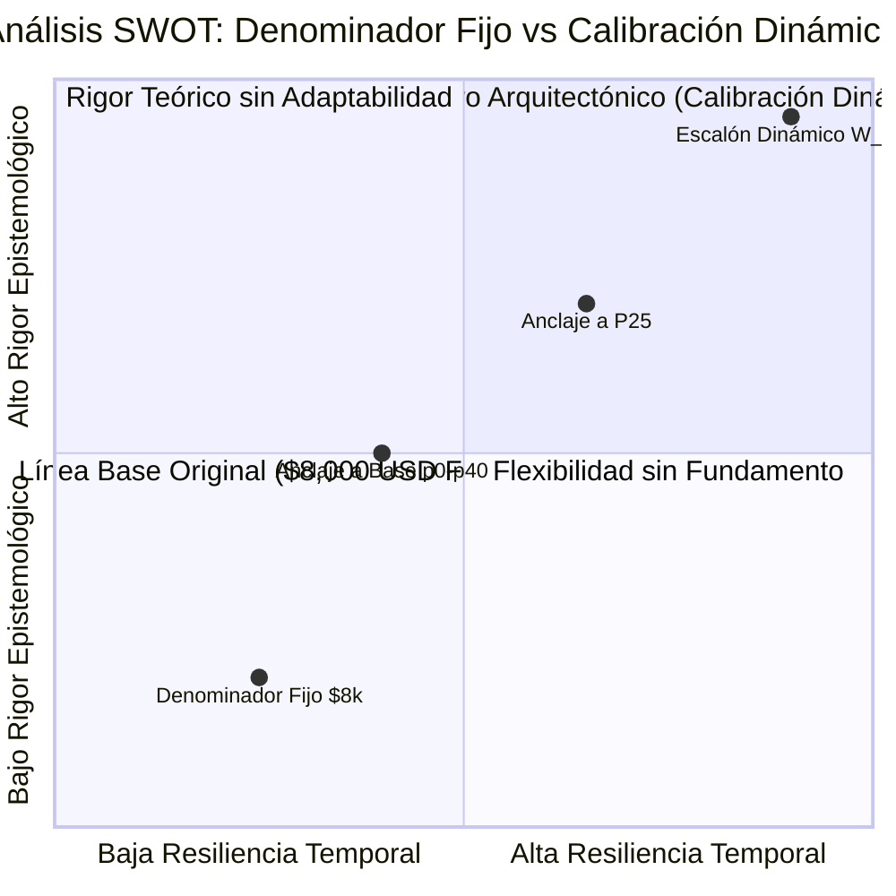

# OpenWiki · Documento 25
# Auditoría Epistemológica, Matemática y Arquitectónica del "Escalón Patrón"

---

## 1. Resumen Ejecutivo y Objeto de la Auditoría

Este documento recoge la auditoría formal y exhaustiva de la regla de conversión espacial fundacional del proyecto, históricamente formulada como:

$$\text{Altura Física} = \left( \frac{\text{Riqueza Individual (USD)}}{8.000\text{ USD}} \right) \times 0.15\text{ m}$$

La hipótesis de diseño original pretendía anclar la experiencia perceptual en una referencia háptica humana cotidiana (**la contrahuella de un escalón estándar de escalera, $\approx 15\text{ cm}$**) y calibrarla con la mediana económica observada en el informe *UBS Global Wealth Report 2024* ($\approx \$8.910\text{ USD}$, redondeada a $\$8.000\text{ USD}$).

Sin embargo, someter esta regla a una revisión epistemológica revela una **falacia de reificación**: los $\$8.000\text{ USD}$ no constituyen una constante universal, física ni económica. Son un **dato empírico contingente** de un año específico ($2024$), en una moneda específica ($\text{USD}$), bajo una metodología particular de estimación patrimonial.

---

## 2. Separación Ontológica de los Tres Elementos

Para construir una arquitectura atemporal y robusta, es imperativo desacoplar formalmente los tres componentes que fueron amalgamados en la primera versión del sistema:

```
┌─────────────────────────────────────────────────────────────────────────┐
│                     TRÍADA ONTOLÓGICA DEL ESCALÓN                       │
├─────────────────────────┬────────────────────────┬──────────────────────┤
│ 1. CONSTANTE FÍSICA     │ 2. DATO EMPÍRICO       │ 3. ABSTRACCIÓN       │
│    (Invariante Corporal)│    (Contingencia Temporal)│ (Función de Diseño) │
├─────────────────────────┼────────────────────────┼──────────────────────┤
│ • Δh_step = 0.15 m      │ • Mediana UBS 2024:    │ • Decisión pedagógica│
│   (15 cm).              │   $8,910 USD.          │   de vincular        │
│ • Altura estándar de la │ • Base inferior p0-p40:│   1 escalón físico   │
│   contrahuella según ley│   $1,748 USD.          │   con el orden de    │
│   de Blondel (2c+h=64). │ • Sujeto a inflación,  │   magnitud de la     │
│ • No cambia con el      │   deflación, shocks de │   mediana mundial.   │
│   mercado ni el tiempo. │   mercado y demografía.│ • Calibrable.        │
└─────────────────────────┴────────────────────────┴──────────────────────┘
```

### A. La Constante Física ($15\text{ cm}$)
Pertenece al dominio biomecánico y de la percepción humana. Un ser humano en cualquier continente reconoce de forma instintiva la altura de un escalón ordinario. Su valor es una **invariante de interfaz**.

### B. El Dato Empírico ($\sim \$8.000 - \$8.910\text{ USD}$)
Pertenece al dominio de la econometría descriptiva histórica. Depende de las cotizaciones bursátiles, el valor de la vivienda, la tasa de cambio y la cobertura de registros fiscales en el año de medición. Tratarlo como una constante universal produce **deriva conceptual (conceptual drift)**.

### C. La Decisión de Abstracción
Es el contrato de escalado pedagógico que mapea el dominio monetario en el dominio físico:
$$\text{Scale Factor} = \frac{\Delta h_{\text{step}}}{W_{\text{ref}}(\mathcal{D})}$$
donde $W_{\text{ref}}(\mathcal{D})$ es un parámetro derivado formalmente de la distribución observada $\mathcal{D}$.

---

## 3. Diagnóstico Epistemológico y Falsación de la Hipótesis de Trabajo

### La Hipótesis de Trabajo
> *"El escalón de 15 cm puede funcionar como una unidad física relativamente estable y universalmente intuitiva, mientras que la cantidad de riqueza necesaria para representar un escalón debe derivarse dinámicamente de la distribución económica vigente."*

### Prueba de Falsación Epistemológica
¿Qué ocurre si la distribución económica global cambia radicalmente en el futuro?

1. **Escenario de Hiperinflación Monetaria ($10\times$):**
   * *Si mantenemos $\$8.000$ fijo:* La mediana mundial sube a $\$89.100\text{ USD}$, lo que equivale a **$1.67\text{ metros}$** (¡la altura de un adulto de pie!). La afirmación *"la mitad del planeta no supera un escalón"* se convierte en una **mentira visual**, pues el estrato ahora mide 11 escalones apilados.
   * *Si la escala es dinámica ($W_{\text{ref}} = W_{50}$):* $W_{\text{ref}}$ se actualiza automáticamente a $\$89.100\text{ USD}$, y la mediana sigue midiendo **$15\text{ cm}$** ($1\text{ escalón}$). La metáfora permanece matemáticamente verdadera y pedagógicamente intacta.
2. **Escenario de Cambio de Unidad Monetaria (Ej. Satoshis / BTC):**
   * Si la fuente mide la riqueza en $\text{BTC}$ (donde la mediana es $0.12\text{ BTC}$), un denominador fijo de $8.000$ produce una altura de **$0.000002\text{ metros}$** ($0.002\text{ mm}$), colapsando el sitio web completo a una línea negra plana invisible.

**Conclusión de la Falsación:** La hipótesis sobrevive con honores. Congelar $\$8.000$ destruye la abstracción ante cualquier choque exógeno; independizar la constante física ($15\text{ cm}$) y derivar el parámetro económico ($W_{\text{ref}}$) es la **única arquitectura conceptualmente inmortal**.

---

## 4. Análisis SWOT del "Escalón Patrón"



### Fortalezas (Strengths)
* **Intuitividad Háptica Inmediata:** Transforma una cifra abstracta incomprensible (trillones de dólares) en una experiencia cinestésica corporal.
* **Continuidad Narrativa:** Permite que el usuario entienda que cada paso físico que da al subir una escalera equivale al esfuerzo acumulativo de media humanidad.
* **Simplicidad de Cálculo:** Mapeo lineal estricto sin distorsiones logarítmicas ocultas.

### Debilidades (Weaknesses de la regla fija original)
* **Arbitrariedad del Redondeo:** La elección de $\$8.000$ en lugar de $\$8.910$ introduce un error no documentado del $-10.2\%$.
* **Falsa Ilusión de Ley Natural:** Riesgo de que el estudiante o ciudadano crea que $\$8.000 = 15\text{ cm}$ es una equivalencia física universal.
* **Vulnerabilidad a la Moneda Denominadora:** Dependencia absoluta del dólar estadounidense.

### Oportunidades (Opportunities)
* **Universalidad Multidivisa y Multiépoca:** Con la calibración dinámica, la visualización puede renderizar la Roma imperial (denarios), el siglo XIX (libras esterlinas), el presente o el año 2050 con idéntica elegancia visual.
* **Comparabilidad Inter-País:** Posibilidad de aplicar la misma abstracción a economías locales (ej. Colombia, Japón, Noruega) ajustando el $W_{\text{ref}}$ a la mediana local.

### Amenazas (Threats)
* **Choques de Distribución Asimétricos Extremos:** En escenarios de desigualdad casi absoluta (feudalismo distópico), donde el 99% tiene $\$0$ y una persona tiene $\$10\text{T}$, cualquier anclaje en la mediana colapsa a $W_{50} = 0$, exigiendo guardrails explícitos de división por cero.

---

## 5. Auditoría Matemática y Matriz de Estrés Multi-Régimen

Se sometieron **6 métodos de calibración** a **10 regímenes macroeconómicos extremos** en un banco de pruebas automatizado (`tests/calibration-stress-test.mjs`):

```
R1: Baseline Oficial UBS 2024 (Mediana $8,910 | Cúspide $737.5B)
R2: Hiperinflación Monetaria 10x (Mediana $89,100 | Cúspide $7.375T)
R3: Crecimiento Real Global 3x (Mediana $26,730 | Cúspide $2.21T)
R4: Gran Igualación Nórdica Gini 0.15 (Mediana $45,000 | Cúspide $250k)
R5: Hiperdesigualdad Feudal Gini 0.98 (Mediana $1,200 | Cúspide $15T)
R6: Colapso y Deflación -60% (Mediana $3,564 | Cúspide $295B)
R7: Economía de Subsistencia Extrema (Mediana $150 | Cúspide $50M)
R8: Denominación en Cripto/BTC (Mediana 0.12 BTC | Cúspide 9.8M BTC)
R9: Polarización Asimétrica (Mediana $2,500 | Cúspide $2.5T)
R10: Proyección Futura 2050 (Mediana $28,500 | Cúspide $3.2T)
```

### Matriz Comparativa de Métodos

| Método | Fórmula $W_{\text{ref}}$ | Regímenes Superados | Altura Mediana (R1) | Altura Cúspide (R1) | Diagnóstico de Robustez |
|---|---|:---:|:---:|:---:|---|
| **M0: Fijo $8.000 USD** | $8.000$ | **5/10 (50%)** | $16.71\text{ cm}$ | $13.828\text{ km}$ | ❌ **CRÍTICO:** Colapsa en hiperinflación ($1.67\text{ m}$), deflación ($0.28\text{ cm}$) y cambio de moneda. |
| **M1: Mediana Pura** | $W_{50}$ | **10/10 (100%)** | $15.00\text{ cm}$ | $12.415\text{ km}$ | ✅ **ÓPTIMO:** Preservación 100% matemática del escalón. |
| **M2: Mediana Amigable (1k)** | $\text{round}_{1k}(W_{50})$ | **10/10 (100%)** | $14.85\text{ cm}$ | $12.291\text{ km}$ | ✅ **EXCELENTE:** Combina pedagogía con estabilidad total. |
| **M3: Media de la Base** | $W_{\text{base}}$ | **9/10 (90%)** | $76.46\text{ cm}$ | $63.286\text{ km}$ | ⚠️ **DEFICIENTE:** En desigualdad extrema, la mediana se infla a más de $2.2\text{ metros}$. |
| **M4: Cuartil Inferior P25** | $W_{25}$ | **10/10 (100%)** | $47.73\text{ cm}$ | $39.508\text{ km}$ | ⚠️ **CONFUSO:** La mediana mide 3 escalones, perdiendo el anclaje del peldaño único. |
| **M5: Magnitud Canónica** | $\text{MagSig}(W_{50})$ | **10/10 (100%)** | $13.36\text{ cm}$ | $11.062\text{ km}$ | ✅ **MUY BUENO:** Números limpios ($1, 2, 5, 10$). |

---

## 6. Distinción Vital: Inflación vs Calibración Distributiva

Es crucial no confundir la **normalización temporal de precios** con la **calibración distributiva de la abstracción**:

```
                              DATO FUENTE
                             (Ej. UBS 2024)
                                   │
                                   ▼
                    ┌──────────────────────────────┐
                    │ 1. NORMALIZACIÓN TEMPORAL    │
                    │    (Inflation Adjuster)      │
                    │    $2024 USD → $2026 USD*    │
                    │    (Preserva poder de compra)│
                    └──────────────┬───────────────┘
                                   │
                                   ▼
                    ┌──────────────────────────────┐
                    │ 2. CALIBRACIÓN DISTRIBUTIVA  │
                    │    (Distribution Engine)     │
                    │    W_ref = f(W_50)           │
                    │    (Preserva metáfora visual)│
                    └──────────────┬───────────────┘
                                   │
                                   ▼
                    ┌──────────────────────────────┐
                    │ 3. ESCALADO ESPACIAL FÍSICO  │
                    │    h = (W / W_ref) × 0.15 m  │
                    │    (Renderizado en Pantalla) │
                    └──────────────────────────────┘
```

* **Normalización Inflacionaria ($+5.4\%$ a 2026):** Responde a la pregunta: *"¿Cuánto vale el dinero histórico en el año presente?"*
* **Calibración Distributiva ($W_{\text{ref}} = W_{50}$):** Responde a la pregunta: *"¿Cuánta riqueza se requiere en esta sociedad para subir el primer escalón?"*

---

## 7. Guardrails de Ruptura y Condiciones de Invalidación

El sistema de calibración dinámica debe suspender la generación y emitir una alerta arquitectónica (`ABSTRACTION_LIMIT_REACHED`) si se detecta alguna de las siguientes condiciones límite:

1. **Mediana Negativa o Nula ($W_{50} \le 0$):**
   * Ocurre si más del 50% de la población mundial tiene patrimonio neto negativo (deuda neta).
   * *Acción:* La escala lineal simple no puede utilizar la mediana como denominador. Requiere cambio a modelo de sustrato subterráneo.
2. **Ratio Cúspide / Mediana Extragaláctico ($h_{\text{apex}} > 384.400\text{ km}$, más allá de la Luna):**
   * *Acción:* Supera la capacidad de compresión pedagógica orbital terrestre. Requiere advertencia de extrapolación astronómica.
3. **Colapso de Varianza ($W_{99} / W_{50} < 1.05$):**
   * *Acción:* En una sociedad de igualdad absoluta perfecta, la visualización pierde sentido como escalera vertical.

---

## 8. Especificación Arquitectónica del Modelo

### Esquema Formal de Datos
```json
{
  "abstraction_model": {
    "version": "v1.0.0-dynamic-calibration",
    "physical_step_invariant_meters": 0.15,
    "calibration_strategy": "ROUNDED_MEDIAN_ANCHOR",
    "source_dataset_id": "ubs_2024_forbes_2026",
    "target_year": 2026,
    "derived_parameters": {
      "raw_median_wealth_usd": 8910,
      "inflation_adjusted_median_usd": 9388,
      "economic_reference_step_usd": 9000,
      "nominal_reference_step_usd": 8000
    }
  }
}
```

### Contrato Matemático
$$\text{Altura}(W, \text{isPV}) = \frac{W \times (\text{isPV} ? \kappa_{\text{inf}} : 1)}{W_{\text{ref}}(\text{isPV})} \times 0.15\text{ m}$$

---

## 9. Decisión y Recomendaciones de Transición

1. **Para Fase 0 (Baseline Stabilization - Champion Actual):**
   * Mantener en la interfaz visual la relación canónica actual ($8.000\text{ USD} \approx 15\text{ cm}$), explicitando en la ficha metodológica que representa el redondeo pedagógico de la mediana empírica observada.
2. **Para Fase 1 (Automated Pipeline - Challenger Sandbox):**
   * Adoptar el método **M2 (`ROUNDED_MEDIAN_1K`)** en el `ScaleRecalibrator`, eliminando definitivamente cualquier constante hardcodeada `8000` en los generadores de contratos y tests sintéticos.
3. **Trazabilidad Total:**
   * Todo dataset compilado debe registrar en sus metadatos internos la procedencia matemática de su denominador de escala.
