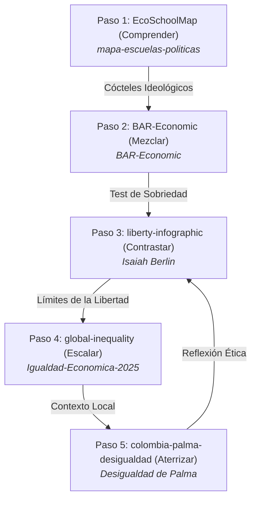

# 🌌 ¿A qué altura vives? · Paso 4 / How High Do You Stand? · Step 4

### *Visualización interactiva y scrollytelling de la brecha de riqueza mundial, convirtiendo patrimonio neto en altura física.*
### *An interactive scrollytelling visualization of the global wealth gap, converting net worth into physical height.*

---

[](https://willkwolf.github.io/global-inequality-21Century/)
[](https://github.com/willkwolf/global-inequality-21Century)
[](https://github.com/VibiumDev/vibium)
[](https://creativecommons.org/licenses/by/4.0/)

---

## 📌 Estado del Sistema y Gobernanza (Versión 2.1.0)
- **Versión:** `v2.1.0 (Vibium Verified)`
- **Fecha de Publicación:** `Agosto 2026`
- **Fuentes Primarias:** *UBS Global Wealth Report 2024*, *Forbes Real-Time Billionaires* (mayo 2026), *World Inequality Database (WID.world)*.
- **Metodología de Escala:** Jan Pen Parade (1971) actualizado; $1\text{ escalón} (15\text{ cm}) \approx \text{Mediana global de riqueza } (\$8,000\text{ USD})$.
- **Estado de la Abstracción:** `VALID_ABSTRACTION` (Certificado por Vibium Verification Engine).

---

## 🌐 Demo en Vivo / Live Demo
**👉 [Ver en vivo en GitHub Pages](https://willkwolf.github.io/global-inequality-21Century/)**

---

## 🧭 La Ruta del Pensamiento Crítico (El Ecosistema)
Este proyecto forma parte de **"La Ruta del Pensamiento Crítico"**, una red interactiva de 5 webs estáticas de `@willkwolf` que conectan teoría económica, dilemas políticos, brechas materiales y contextos locales:



---

## 🏛 Arquitectura de Desacoplamiento: Qué Cambia y Qué Permanece

Para garantizar que el sistema sea autoactualizable mediante agentes de IA sin romper la abstracción pedagógica, los componentes se rigen por la siguiente matriz:

| Categoría | Componentes | Descripción y Regla de Gobernanza |
|---|---|---|
| 🟢 **CONSERVADO** | **Metáfora de altura espacial**, Scrollytelling vertical, Contrato de Abstracción, Accesibilidad WCAG 2.1 AAA, Integridad matemática. | Inmutables. Ningún agente puede alterar la regla de Jan Pen ni destruir la experiencia pedagógica. |
| 🟡 **ADAPTABLE** | **Valor del escalón ($USD)**, Altura máxima de la cúspide, Textos y titulares bilingües (ES/EN), Iconos SVG de estratos, Fechas de fuentes. | Recalibrados automáticamente por el agente ante **Data Drift** o **Semantic Drift**. |
| 🔵 **CAMBIADO** | **Renderizado dinámico de $N$ estratos**, Desacoplamiento total del DOM, Motor de Drift en 5 ejes, Capa de Verificación Vibium. | Arquitectura modular en `src/` con validación en servidor local y navegador real. |
| 🔴 **DEPRECATED** | Loops estáticos de 8 estratos fijos, Nombres de multimillonarios hardcodeados en HTML, Footers estáticos desactualizados. | Eliminados por completo del codebase. |

---

## 🔬 Capa de Verificación Vibium (Vibium Verification Layer)

Vibium opera como verificador autónomo independiente sobre la aplicación servida en tiempo real (`http://127.0.0.1:8088`):

```
DATA → CANONICAL MODEL → AI ADAPTATION → BUILD → LOCAL SERVER → VIBIUM VERIFICATION → GITHUB PAGES
```

### Resultados de la Suite de Verificación
1. **Escenario 1 (Data Drift Probable):** Mediana sube a $\$11,200\text{ USD}$, cúspide a $\$940\text{B USD}$ $\to$ **`PASS_WITH_ADAPTATION`** (*Evidencia:* `artifacts/vibium/scenario-1/final-recording.zip`).
2. **Escenario 2 (Methodological & Semantic Drift):** Metodología PPP, 6 estratos dinámicos, Fondo Soberano $\to$ **`PASS_WITH_ADAPTATION`** (*Evidencia:* `artifacts/vibium/scenario-2/final-recording.zip`).
3. **Escenario 3 (Chaotic / Adversarial Drift):** Mediana negativa destructiva de $-\$50\text{M USD}$ $\to$ **`ABSTRACTION_LIMIT_REACHED`** (Publicación detenida, *Evidencia:* `artifacts/vibium/scenario-3/final-recording.zip`).
4. **12 Pruebas Sintéticas Extremas:** Cobertura de valores ínfimos, hiperinflación, varianza nula, deuda subterránea, outliers astronómicos, feeds corruptos y datasets incompletos.

---

## 🧠 Pruebas Cognitivas Pedagógicas (Efecto Contraste)
La visualización permite comparar la percepción subjetiva con la distribución real:
- **Escenario A ("Soy muy rico"):** Quien tiene $\$1\text{M USD}$ descubre que su altura ($18.75\text{ m}$) está a nivel de una escalera frente a los $15,731\text{ km}$ de la órbita.
- **Escenario B ("Soy muy pobre"):** Quien tiene $\$1,700\text{ USD}$ comprende que el 40% de la población mundial comparte el estrato de $3.3\text{ cm}$ (el guijarro).
- **Escenario C ("Soy clase media"):** Quien tiene $\$36,000\text{ USD}$ ve que está a la altura de una silla de bar ($68\text{ cm}$), con el $99.999996\%$ de la distancia aún por encima.

---

## 🤓 La Fórmula de Escala
$$\text{Altura física (m)} = \left(\frac{\text{Patrimonio Neto (USD)}}{\$8,000}\right) \times 0.15\text{ m}$$

---

## 🛠️ Instalación y Ejecución Local

### Requisitos
* **Node.js** 20+
* **Vibium** (CLI global o runner local)

### Instalación de Vibium y Skill
```bash
# Instalación global de Vibium
npm install -g vibium

# Instalación del skill Vibium Vibe-Check
npx skills add https://github.com/VibiumDev/vibium --skill vibe-check

# Instalación de dependencias del repositorio
npm install
```

### Ejecutar Suite Completa de Tests y Verificación Vibium
```bash
# Compilar e inyectar datos del SPEC
npm run apply-spec

# Ejecutar verificación completa (Contratos + Drift + 3 Escenarios + Vibium + Parallax + Robustez 100/100)
npm test

# Ejecutar exclusivamente la suite de verificación Vibium
npm run test:vibium
```

---

## 📚 Documentación y Gobernanza en OpenWiki
Para consultar el registro inmutable de decisiones, bitácora de advertencias y modelos ontológicos, visita el directorio [`OpenWiki/`](./OpenWiki/README.md).

---

## 📜 Licencia / License
Este proyecto se publica bajo la licencia **Creative Commons Attribution 4.0 International (CC BY 4.0)**.
