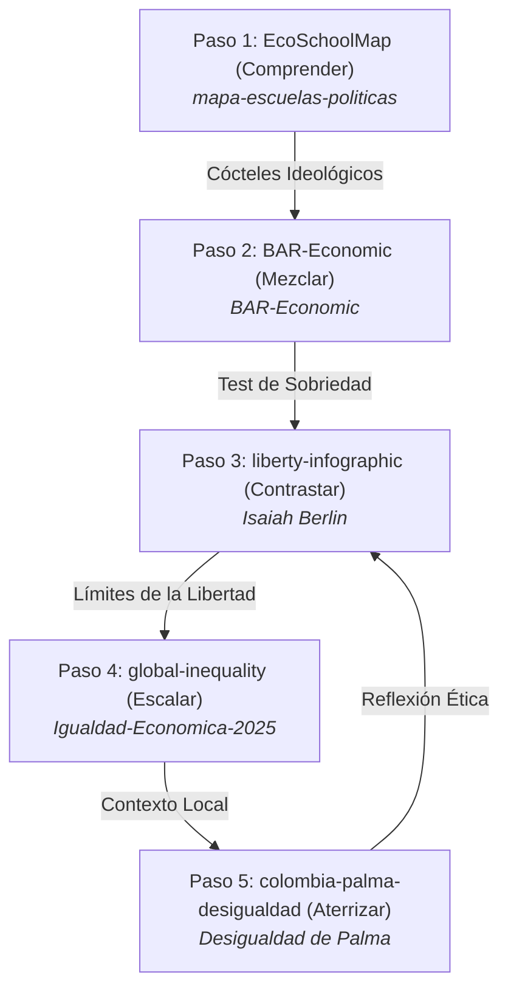
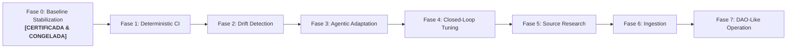

# 🌌 ¿A qué altura vives? · Paso 4 / How High Do You Stand? · Step 4

### *Visualización interactiva y scrollytelling de la brecha de riqueza mundial, convirtiendo patrimonio neto de personas naturales en altura física.*
### *An interactive scrollytelling visualization of the global wealth gap, converting individual net worth of natural persons into physical height.*

---

[](https://willkwolf.github.io/global-inequality-21Century/)
[](https://github.com/willkwolf/global-inequality-21Century)
[](https://github.com/VibiumDev/vibium)
[](./OpenWiki/15_UNIDAD_DE_ANALISIS_Y_FILTRO_DE_ENTIDADES.md)
[](./OpenWiki/21_INVARIANTES_TEMPORALES_Y_FORMATO_NUMERICO_I18N.md)
[](./OpenWiki/26_CERTIFICACION_FASE_0_Y_FIRMA_DEL_CHAMPION.md)
[](https://creativecommons.org/licenses/by/4.0/)

---

## 📌 Estado del Sistema: Champion de Producción (Fase 0 Concluida)

* **Fase Actual:** **`PHASE 0 — BASELINE STABILIZATION (CERTIFIED & FROZEN CHAMPION)`**
* **Versión Oficial:** `BASELINE v0.9 (Champion en Producción)`
* **Período:** `En cuarentena de estabilidad pasiva previa a Fase 1 (Deterministic CI)`
* **Unidad de Análisis Inmutable:** **EXCLUSIVAMENTE PERSONAS NATURALES (ADULTOS)**. Prohibición estricta de personas jurídicas, corporaciones, fondos soberanos o estados.
* **Invariantes Globales:**
  1. **Año Objetivo Dinámico:** `target_year = current_year()` obtenido en tiempo de ejecución.
  2. **Formateo Numérico Centralizado:** Separación estricta entre valor numérico exacto de cálculo y valor presentado (`Intl.NumberFormat`), respetando `CURRENCY (USD) ≠ LOCALE (es / en)`.
  3. **Desacoplamiento del Escalón:** La constante física corporal ($15\text{ cm}$) es un invariante de diseño; la calibración económica ($W_{\text{ref}}$) es un parámetro empírico dinámico derivado de la mediana ($W_{50}$).
  4. **Toggle Dual Nominal / Valor Presente:** Switch estético frosted glass que conmuta instantáneamente entre datos históricos originales de la fuente y cifras a valor presente ajustadas por inflación CPI-U ($+5.4\%$).
* **Fuentes Primarias:** *UBS Global Wealth Report 2024* (datos al 31 dic 2024) y *Forbes Real-Time Billionaires* (corte mayo 2026).

---

## 🌐 Demo en Vivo / Live Demo
**👉 [Ver visualizador en vivo en GitHub Pages](https://willkwolf.github.io/global-inequality-21Century/)**

---

## 🧭 La Ruta del Pensamiento Crítico (El Ecosistema)
Este proyecto forma parte de **"La Ruta del Pensamiento Crítico"**, una red interactiva de 5 aplicaciones web estáticas de `@willkwolf` que conectan teoría económica, dilemas políticos, brechas materiales y realidades locales:



---

## 🏛 Arquitectura y Matriz de Gobernanza: Qué Cambia y Qué Permanece

| Categoría | Componentes | Regla de Gobernanza |
|---|---|---|
| 🟢 **CONSERVADO** | **Metáfora de altura física**, scrollytelling vertical, contrato de Jan Pen (*Lie Factor* = 1.0), **Persona Natural exclusiva**, accesibilidad WCAG 2.1 AAA. | Inmutables. Ningún agente puede alterar la regla de escala vertical ni incluir entidades no naturales. |
| 🟡 **ADAPTABLE** | **Valor del escalón ($USD)** derivado de la mediana, altura de la cúspide, captions bilingües (ES/EN), badges de procedencia temporal, iconos SVG. | Recalibrados automáticamente ante **Data Drift** o **Semantic Drift**. |
| 🔵 **CAMBIADO** | **Compilación dinámica de $N$ estratos**, desacoplamiento total del DOM, centralización en `OpenWiki/`, módulo `InflationAdjuster`, suite Vibium dual. | Arquitectura modular en `src/` y contratos formales bajo `OpenWiki/`. |
| 🔴 **DEPRECATED** | Denominadores hardcodeados, loops fijos de 8 estratos, textos estáticos dependientes de datos, años fijos en lógica. | Eliminados definitivamente del codebase. |

---

## 🔬 Verificación Vibium & Suites de Calidad (100% Passing)

El sistema cuenta con un marco de verificación transversal determinista:
1. **Suite Unitaria y DOM (`tests/unit/`):** 8 suites probando formateo numérico, normalización temporal, modelo canónico, drift, escalón y toggle interactivo.
2. **Suite Vibium Dual:** Verificación en navegadores reales en resolución **Mobile-First (390x844)** y **Desktop (1920x1080)** con cero desbordes ni regresiones de contraste.
3. **Suite de 3 Escenarios de Drift:** Validación de resiliencia ante Data Drift Probable, Methodological Drift y Chaotic Drift con activación de guardrails (`ABSTRACTION_LIMIT_REACHED`).
4. **Suite Sintética Challenger (25 iteraciones):** Simulación Monte Carlo en sandboxes en memoria sin mutar la producción.
5. **Suite de Estrés de Calibración:** Evaluación en 10 regímenes macroeconómicos extremos (hiperinflación, deflación, sociedades igualitarias, feudalismo digital).

---

## 🗺️ Roadmap de Automatización Progresiva (7 Fases)



Consulta los detalles del roadmap en [`OpenWiki/20_ROADMAP_AUTOMATIZACION_PROGRESIVA_Y_GOBERNANZA_DAO.md`](./OpenWiki/20_ROADMAP_AUTOMATIZACION_PROGRESIVA_Y_GOBERNANZA_DAO.md).

---

## 🛠️ Instalación y Comandos Operativos

```bash
# Instalar dependencias
npm install

# Compilar e inyectar datos del SPEC oficial
npm run apply-spec

# Ejecutar la suite completa de pruebas determinísticas
npm test

# Ejecutar la suite de estrés macroeconómico del escalón
npm run test:stress

# Validar integridad del esquema JSON de datos
npm run validate-spec
```

---

## 📚 Documentación y Verdad Documental en OpenWiki
Toda la documentación, contratos formales, actas de auditoría y modelos de gobernanza residen en [`OpenWiki/`](./OpenWiki/README.md) (**26 Documentos de Gobernanza**).

---

## 📜 Licencia / License
Este proyecto se publica bajo la licencia **Creative Commons Attribution 4.0 International (CC BY 4.0)**.
