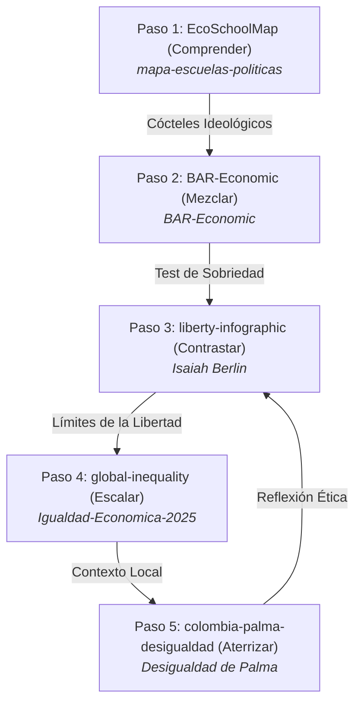
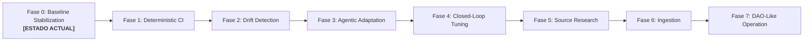

# 🌌 ¿A qué altura vives? · Paso 4 / How High Do You Stand? · Step 4

### *Visualización interactiva y scrollytelling de la brecha de riqueza mundial, convirtiendo patrimonio neto de personas naturales en altura física.*
### *An interactive scrollytelling visualization of the global wealth gap, converting individual net worth of natural persons into physical height.*

---

[](https://willkwolf.github.io/global-inequality-21Century/)
[](https://github.com/willkwolf/global-inequality-21Century)
[](https://github.com/VibiumDev/vibium)
[](./OpenWiki/15_UNIDAD_DE_ANALISIS_Y_FILTRO_DE_ENTIDADES.md)
[](./OpenWiki/19_BASELINE_OFICIAL_Y_FASE_0_ESTABILIZACION.md)
[](https://creativecommons.org/licenses/by/4.0/)

---

## 📌 Estado del Sistema y Gobernanza: Baseline Oficial v0.9
- **Fase Actual:** **`FASE 0 — BASELINE STABILIZATION (HIGH HUMAN-IN-THE-LOOP)`**
- **Versión:** `BASELINE v0.9 (Vibium Verified & Strict Natural Person Model)`
- **Fecha de Publicación:** `Agosto 2026`
- **Unidad de Análisis Inmutable:** **EXCLUSIVAMENTE PERSONAS NATURALES (ADULTOS)**. Se prohíbe la inclusión o comparación con empresas, personas jurídicas, fundaciones, corporaciones, estados o fondos soberanos.
- **Fuentes Primarias:** *UBS Global Wealth Report 2024*, *Forbes Real-Time Billionaires* (corte mayo 2026), *World Inequality Database (WID.world)*.
- **Metodología de Escala:** Jan Pen Parade (1971) actualizado; $1\text{ escalón} (15\text{ cm}) \approx \text{Mediana global de riqueza } (\$8,000\text{ USD})$.
- **Estado de la Abstracción:** `VALID_WITH_LIMITATIONS` (Certificado por Vibium Verification Engine en Mobile y Desktop).

---

## 🌐 Demo en Vivo / Live Demo
**👉 [Ver en vivo en GitHub Pages](https://willkwolf.github.io/global-inequality-21Century/)**

---

## 🧭 La Ruta del Pensamiento Crítico (El Ecosistema)
Este proyecto forma parte de **"La Ruta del Pensamiento Crítico"**, una red interactiva de 5 webs estáticas de `@willkwolf` que conectan teoría económica, dilemas políticos, brechas materiales y contextos locales:



---

## 🏛 Arquitectura de Desacoplamiento: Qué Cambia y Qué Permanece

Para garantizar que el sistema sea autoactualizable mediante agentes de IA sin romper la abstracción pedagógica, los componentes se rigen por la siguiente matriz de gobernanza:

| Categoría | Componentes | Descripción y Regla de Gobernanza |
|---|---|---|
| 🟢 **CONSERVADO** | **Metáfora de altura espacial**, Scrollytelling vertical, Contrato de Abstracción, **Unidad de análisis exclusiva de Persona Natural**, Accesibilidad WCAG 2.1 AAA, Integridad matemática (*Lie Factor* = 1.0). | Inmutables. Ningún agente puede alterar la regla de Jan Pen ni comparar personas con corporaciones o estados. |
| 🟡 **ADAPTABLE** | **Valor del escalón ($USD)**, Altura máxima de la cúspide, Captions derivados matemáticamente, Textos y titulares bilingües (ES/EN), Iconos SVG de estratos, Fechas de fuentes y versiones metodológicas (`SOURCE · PERIOD · VERSION`). | Recalibrados automáticamente por el agente ante **Data Drift** o **Semantic Drift**. |
| 🔵 **CAMBIADO** | **Renderizado dinámico de $N$ estratos**, Desacoplamiento total del DOM, Filtro Ontológico de Entidades (`EntityFilter`), Motor de Drift en 5 ejes, Capa de Verificación Vibium (Dual: Mobile + Desktop). | Arquitectura modular en `src/` con validación en servidor local y navegador real. |
| 🔴 **DEPRECATED** | Loops estáticos de 8 estratos fijos, Captions hardcodeados desactualizados, Entidades no naturales en la cúspide. | Eliminados por completo del codebase. |

---

## 🔬 Capa de Verificación Vibium (Vibium Verification Layer)

Vibium opera como verificador autónomo independiente sobre la aplicación servida en tiempo real (`http://127.0.0.1:8088`), validando simultáneamente en resoluciones **Mobile-First (390x844)** y **Desktop (1920x1080)**:

```
DATA → ENTITY FILTER → CANONICAL MODEL → AI ADAPTATION → BUILD → LOCAL SERVER → VIBIUM DUAL VERIFICATION → GITHUB PAGES
```

### Resultados de la Suite de Verificación
1. **Escenario 1 (Data Drift Probable):** Mediana sube a $\$11,200\text{ USD}$, cúspide a $\$940\text{B USD}$ con Bernard Arnault $\to$ **`PASS_WITH_ADAPTATION`** (*Evidencia:* `artifacts/vibium/scenario-1/final-recording.zip`).
2. **Escenario 2 (Methodological & Semantic Drift):** Metodología PPP, 6 estratos dinámicos, Larry Ellison en la cúspide $\to$ **`PASS_WITH_ADAPTATION`** (*Evidencia:* `artifacts/vibium/scenario-2/final-recording.zip`).
3. **Escenario 3 (Chaotic / Adversarial Drift):** Mediana negativa destructiva de $-\$50\text{M USD}$ $\to$ **`ABSTRACTION_LIMIT_REACHED`** (Publicación detenida de forma segura, *Evidencia:* `artifacts/vibium/scenario-3/final-recording.zip`).
4. **12 Pruebas Sintéticas Extremas:** Cobertura de valores ínfimos, hiperinflación, varianza nula, deuda subterránea, outliers astronómicos, rechazo de fondos/estados (`Case 10`), feeds corruptos y datasets incompletos (12/12 Superadas).

---

## 🗺️ Roadmap de Automatización Progresiva (Fases 0 a 7)



Consulta los detalles de cada fase en [`OpenWiki/20_ROADMAP_AUTOMATIZACION_PROGRESIVA_Y_GOBERNANZA_DAO.md`](./OpenWiki/20_ROADMAP_AUTOMATIZACION_PROGRESIVA_Y_GOBERNANZA_DAO.md).

---

## 🧠 Pruebas Cognitivas Pedagógicas (Efecto Contraste)
La visualización permite contrastar la percepción subjetiva con la distribución real:
- **Escenario A ("Soy muy rico"):** Quien tiene $\$1\text{M USD}$ descubre que su altura ($18.75\text{ m}$) está a nivel de una escalera doméstica frente a los $13,828\text{ km}$ de la órbita de Elon Musk.
- **Escenario B ("Soy muy pobre"):** Quien tiene $\$1,748\text{ USD}$ comprende que el 40.7% de la población mundial comparte el estrato de $3.3\text{ cm}$ (el guijarro en el suelo).
- **Escenario C ("Soy clase media"):** Quien tiene $\$36,000\text{ USD}$ ve que está a la altura de una silla de bar ($67.5\text{ cm}$), con el $99.999\%$ de la distancia aún por encima.

---

## 🤓 La Fórmula de Escala
$$\text{Altura física (m)} = \left(\frac{\text{Patrimonio Neto Personal (USD)}}{\$8,000}\right) \times 0.15\text{ m}$$

---

## 🛠️ Instalación y Ejecución Local

### Requisitos
* **Node.js** 20+
* **Vibium** (CLI global o runner local)

### Instalación de Vibium y Skill
```bash
# Instalación global de Vibium
npm install -g vibium

# Instalación del skill Vibium Vibe-Check
npx skills add https://github.com/VibiumDev/vibium --skill vibe-check

# Instalación de dependencias del repositorio
npm install
```

### Ejecutar Suite Completa de Tests y Verificación Vibium
```bash
# Compilar e inyectar datos del SPEC
npm run apply-spec

# Ejecutar verificación completa (SPEC + Unitarios + 3 Escenarios + Vibium + Parallax + Robustez)
npm test

# Ejecutar exclusivamente la suite de verificación Vibium
npm run test:vibium
```

---

## 📚 Documentación y Gobernanza en OpenWiki
Para consultar el registro inmutable de decisiones, bitácora de advertencias y modelos ontológicos, visita el directorio [`OpenWiki/`](./OpenWiki/README.md) con sus **20 documentos de verdad documental**.

---

## 📜 Licencia / License
Este proyecto se publica bajo la licencia **Creative Commons Attribution 4.0 International (CC BY 4.0)**.
