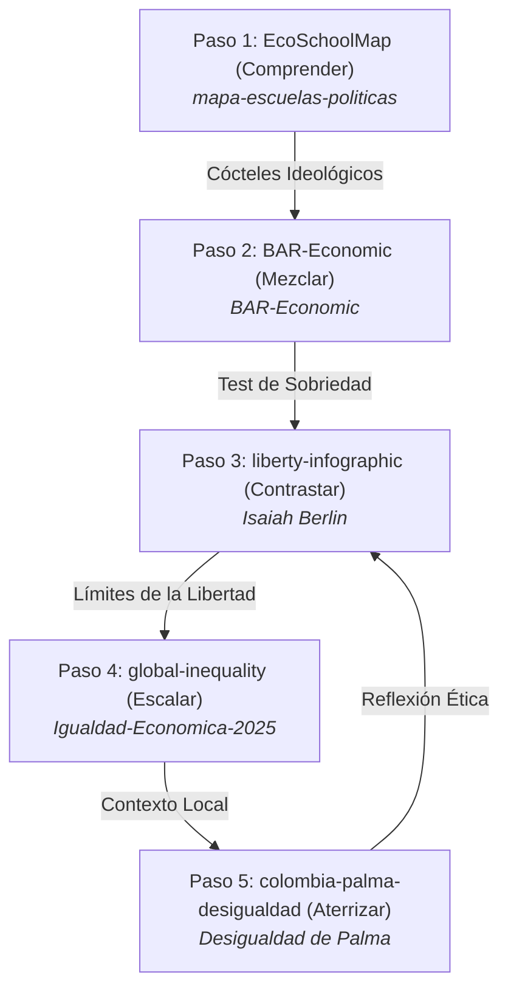

# 🌌 ¿A qué altura vives? · Paso 4 / How High Do You Stand? · Step 4

### *Visualización interactiva y scrollytelling de la brecha de riqueza mundial, convirtiendo patrimonio neto en altura física.*
### *An interactive scrollytelling visualization of the global wealth gap, converting net worth into physical height.*

---

[](https://willkwolf.github.io/global-inequality-21Century/)
[](https://github.com/willkwolf/global-inequality-21Century)
[](https://creativecommons.org/licenses/by/4.0/)
[](https://github.com/willkwolf/global-inequality-21Century)

---

## 🌐 Demo en Vivo / Live Demo
**👉 [Ver en vivo en GitHub Pages](https://willkwolf.github.io/global-inequality-21Century/)**

---

## 🧭 La Ruta del Pensamiento Crítico (El Ecosistema)
Este proyecto forma parte de **"La Ruta del Pensamiento Crítico"**, una red interactiva de 5 webs estáticas de `@willkwolf` que conectan teoría económica, dilemas políticos, brechas materiales y contextos locales.



> [!NOTE]
> **Estás en el Paso 4: Escalar**. En el paso anterior contrastaste los dilemas de la libertad formal. Aquí escalas las colosales dimensiones materiales de la brecha de riqueza mundial en kilómetros reales de distancia. Al final de la página, la necesidad de un contexto nacional te invitará a analizar la brecha en un plano local en el **Paso 5: La Desigualdad de Palma en Colombia**.

---

## 🔍 Contexto Temático / Philosophical Context

### Español
Esta pieza es un scrollytelling de pantalla completa que convierte el patrimonio neto de la población en altura física. Su premisa analítica actualiza el clásico desfile de Jan Pen (1971): si cada escalón estándar de escalera (15 cm) equivale a **$8,000 USD** de patrimonio neto, ¿a qué altura física te encuentras tú respecto a la humanidad? 

El recorrido inicia en el suelo de la base —donde el 40.7 % de los adultos del planeta ocupan apenas la altura de una pequeña piedra de 3.3 cm— y se eleva verticalmente de forma logarítmica atravesando nubes e infraestructura de satélites hasta llegar a la órbita baja de la Tierra, donde la persona más rica del mundo alcanza una colosal altura de **15,731 kilómetros**.

### English
This piece is a full-screen scrollytelling visualizer that translates net worth into physical height. Its analytical premise updates Jan Pen's classic parade (1971): if a standard 15 cm stair step represents **$8,000 USD** of net worth, how high do you physically stand relative to the rest of the world?

The vertical journey begins on the ground — where 40.7% of the world's adults occupy just 3.3 cm (a pebble) — and scales logarithmically through the atmosphere and orbit structures, ending in low Earth orbit where the richest person reaches **15,731 kilometers**.

---

## 🤓 Para el Lector más Nerd / Ficha Técnica (Deep Tech & Data Insights)

### La Fórmula de Escala
$$\text{Altura física (m)} = \left(\frac{\text{Patrimonio Neto (USD)}}{\$8,000}\right) \times 0.15\text{ m}$$
Esta escala garantiza que la mediana de riqueza mundial ($8,654–$9,167 USD) se concrete de forma comprensible e intuitiva a la altura de un solo escalón de escalera.

### Los Ocho Estratos de la Pirámide Global
El visualizador se divide en 8 capas de datos representados secuencialmente:
1. **Órbita Terrestre (15,731 km):** Cúspide de la riqueza (Elon Musk en la instantánea recopilada de mayo de 2026: $636B–$839B).
2. **Estratosfera (18.75 km):** Billonarios globales (patrimonio neto > $1,000 millones).
3. **Atmósfera Media (70.8 m):** Millonarios promedio (~$3.7 millones).
4. **Atmósfera Baja (18.75 m):** Umbral de entrada al millonario ($1 millón).
5. **Altura de Dos Pisos (5.5 m):** Clase media alta global (~$293k de patrimonio promedio, 16.4% de adultos).
6. **Silla de Bar (68 cm):** Mayoría global (~$36k de patrimonio promedio, 41.3% de adultos).
7. **Un Escalón (17 cm):** Mediana mundial de riqueza (50% de la población adulta).
8. **Suelo Base (3.3 cm):** El 40.7% de la base del planeta (~$1,748 de patrimonio promedio).

### Arquitectura a Prueba de Futuro y Neutralidad
El visualizador está **totalmente desacoplado de los datos**. No hay figuras ni nombres hardcodeados. El compilador (`SPEC/scripts/apply-data.js`) consume la fuente de verdad única del **SPEC** (`SPEC/data.json`).
* Si el patrimonio más alto del mundo cambia a otra entidad, organización o persona, basta con editar `metadata.top_wealth_holder` y re-compilar.
* El compilador inyecta dinámicamente las traducciones, las alturas, los sustantivos bilingües de la entidad y las representaciones gráficas SVG.
* **Neutralidad Académica:** La inclusión de Elon Musk en el estrato 1 responde estrictamente a la rigurosidad de los datos de la fuente oficial (*Forbes Real-Time Billionaires*, mayo de 2026) y carece de juicio de valor personal, político o ideológico.

---

## 🛠️ Stack Tecnológico

* **HTML5 & CSS3 Premium:** Con diseño responsivo para móviles de 360px+ y efecto parallax de estrellas interactivo al scroll.
* **JSDOM & Node.js Testing (`tests/`):** Suite robusta que simula 100 iteraciones con datos sintéticos extremos (`synthetic-robustness.test.mjs`) validando la total inmunidad del compilador ante fluctuaciones absurdas y garantizando la coherencia i18n del 100% de las etiquetas del visualizador.
* **Accesibilidad Nativa:** Incluye skip links, panel de accesibilidad local (Ajuste de contraste, modo Dyslexic para facilitar la lectura, 3 escalas dinámicas de texto) y etiquetas semánticas ARIA por sección.

---

## 📦 Instalación y Uso Local

### Requisitos
* **Node.js** 18+ (para compilar y correr tests)

### Servidor de Desarrollo
```bash
# 1. Clonar el repositorio
git clone https://github.com/willkwolf/global-inequality-21Century.git
cd global-inequality-21Century

# 2. Instalar dependencias npm
npm install

# 3. Lanzar servidor de desarrollo o abrir directamente:
# El visualizador principal se encuentra en: Escala-visual-de-riqueza-mundial.html
# Abre el archivo o usa live-server:
npx live-server
```

### Ejecutar Compilador y Tests de Robustez
```bash
# Correr el pipeline oficial que inyecta el SPEC
node SPEC/scripts/apply-data.js

# Ejecutar la suite automatizada de 100 iteraciones
npm test
```

---

## 📝 Cómo Citar / Citation (APA 7)

**Referencia en formato APA 7ma Edición:**
> Artunduaga Viana, W. C. (2026). *¿A qué altura vives? La distancia real entre ricos y pobres es de 15,731 kilómetros* (Versión compilada con datos UBS 2024 / Forbes 2026) [Visualización de datos interactiva]. GitHub. https://github.com/willkwolf/global-inequality-21Century

**BibTeX para investigadores:**
```bibtex
@software{artunduaga2026altura,
  author = {Artunduaga Viana, William Camilo},
  title = {¿A qué altura vives?},
  year = {2026},
  publisher = {GitHub},
  url = {https://github.com/willkwolf/global-inequality-21Century},
  note = {Scrollytelling interactivo bilingüe de la desigualdad global de riqueza basada en UBS y Forbes}
}
```

---

## 📜 Licencia / License

Este proyecto se publica bajo la licencia **Creative Commons Attribution 4.0 International (CC BY 4.0)**.

[](https://creativecommons.org/licenses/by/4.0/)

**Bajo esta licencia puedes:**
* **Compartir:** Copiar, redistribuir y comunicar libremente el material en cualquier medio.
* **Adaptar:** Mezclar, transformar y construir sobre el material para cualquier propósito, incluso comercial.
* **Atribución:** Debes reconocer la autoría de forma correspondiente y proporcionar un enlace a la licencia.
